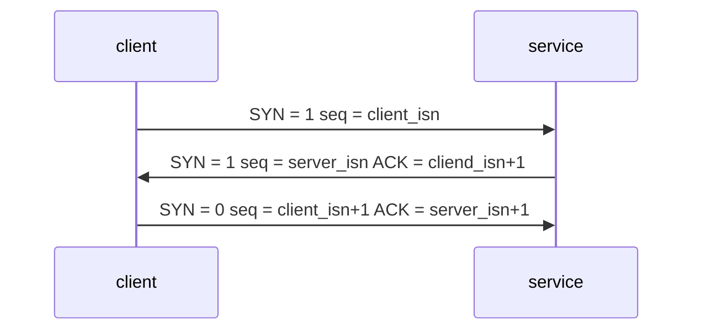
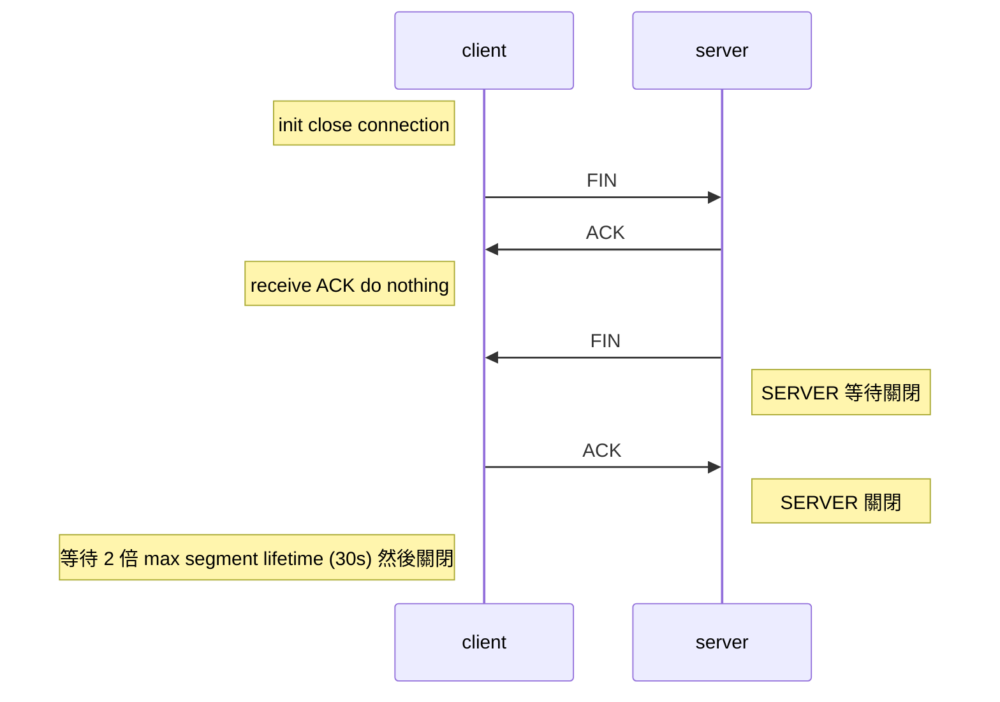
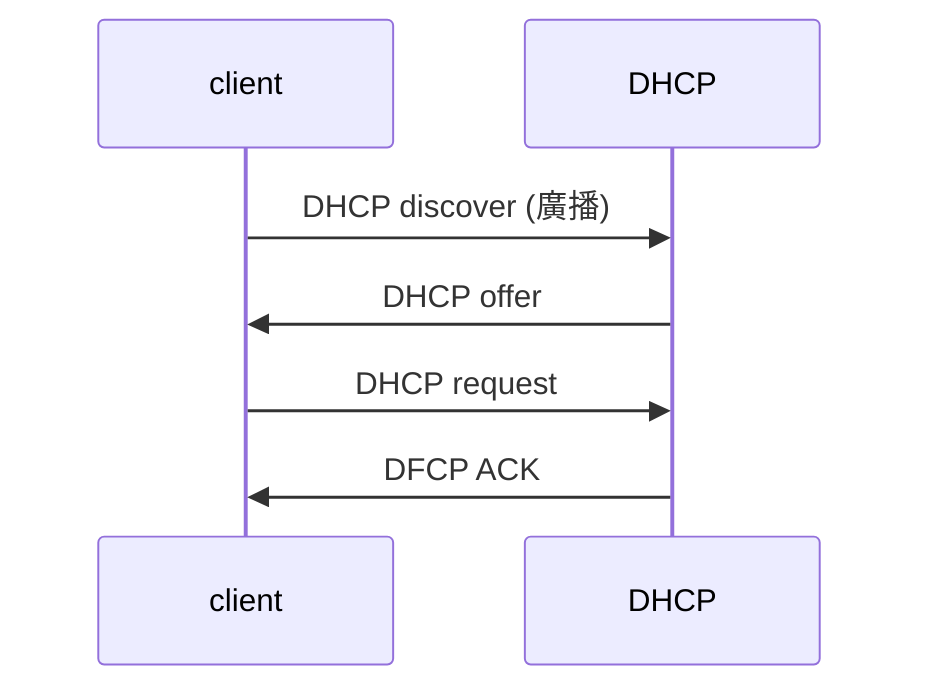

# 計算機網路期末考題精選 - 國立中興大學大資訊工程系 Summer 2020

## Chapter 3

+ What are the header fields to identify a UDP **socket** and a TCP **socket**?
  
  >
  > 這題問的是socket的部分不是封包的差異
  >
  > One subtle difference between a TCP socket and a UDP socket is that a TCP socket is identified by a four-tuple: (source IP address, source port number, destination IP address, destination port number). 
  > 
  > Thus, when a TCP segment arrives from the network to a host, the host uses all four values to direct (demultiplex) the segment to the appropriate socket.
  >  >
  > [https://www.csie.ntu.edu.tw/~b95105/CN/project3/CN_ch03.pdf](https://www.csie.ntu.edu.tw/~b95105/CN/project3/CN_ch03.pdf)
  >
  > 
  > 
  > 
  > 

+ Please list the network applications of UDP
  
  > DNS, 網路電話, 視訊, SNMP(簡單網路管理協定), streaming multimedia(串流媒體)

+ Please describe all necessary mechanisms recover the packets with bit errors
  
  > Reference textbook CH3-4 p.238
  > 
  > 1. Error detection. 錯誤偵測(checksum)
  > 
  > 2. Receiver feedback. receiver 回傳 NAK 給 sender 要求重傳
  > 
  > 3. Retransmission. sender 重傳

+ Please explain why one-bit sequence number is enough for stop-and-wait protocol
  
  > 因為只需要分別上一個傳送過的packet或是正要接收的packet兩種
  > 
  > Reference CH3 p.241
  > 
  > A 1-bit sequence number will suffice, since it will allow the receiver to know whether the sender is resending the previously transmitted packet or a new packet.

+ What is the function of sequence numbers in feedback segments?
  
  > rdt2.2: A sender that receives two ACKs for the same packet (duplicate ACKs) knows that the receiver did not correctly receive the packet following the packet that is being ACKed twice.
  > 
  > sender 可以知道接收端有沒有正確接收到封包
  > 
  > With sequence number, the receiver then need only check this sequence number to determine whether or not the received packet is a retransmission.

+ Please describe all necessary mechanisms to recover packet loss.
  
  > 送出封包前利用一個倒計時器，超時就重新傳送
  > 
  > Reference textbook CH3.4 p.244
  > 
  > In all cases, the action is the same: __retransmit__.
  > The sender will thus need to be able to
  > 
  > 1. start the timer each time a packet (either a first-time packet or a retransmission) is sent.
  > 
  > 2. respond to a timer interrupt (taking appropriate action)
  > 
  > 3. stop timer.

+ Please describe the problems caused by improper timeout values.
  
  > timeout 設太短：導致 sender 一直重送，即使再一下下封包就準備要到了(premature timeout)
  > 
  > timeout 設太長：封包已經掉了，但 sender 卻很晚才發現

+ The performance of te stop-and-wait protocol is poor and can be improved by a pipelining protocol. Please describe the idea for the pipelining protocol.
  
  > 有別於 stop-and-wait 送出一個封包→暫停等待回覆→繼續下一個，pipelining protocol 連續送出多個封包，接收到回覆後就接著繼續送，這樣的效率比 stop-and-wait 高出許多
  > 
  > sender allows multiple, "in-flight", yet-to-be-acknowledged pkts

+ Please describe the difference between Go-Back-N and Selective Repeat for packet retransmission, receiver windows (buffer) size, and numbers of timers.
  
  > |     | retransmission | receiver window | timers |
  > |:---:|:--------------:|:---------------:|:------:|
  > | GBN | sender窗格內封包全部重傳      | 1               | 1      |
  > | SR  | 僅重傳有掉的封包       | N               | N      |
  > 
  > GBN only has timer for oldest unacked packet. If timer expires, it will retransmission "all" unacked packet.
  > 
  > SR maintain timer for each unacked packet. When timer expires, it will retransmission "only" that unacked packet.

+ How many sequence numbers are required for selective repeat? (window size = w)
  
  > If we have N sequences numbers, our windows size do not excessive N/2
  > 
  > That is, we need 2w sequences numbers at last.
  >
 
  > The windows size must be less than or equal to half the size of the sequence number space for SR protocol
  > $$
  > w \leq \frac{1}{2}N
  > $$
  > 
  > $$
  > N \geq 2w
  > $$
  >
  > ~~我剛剛翻考卷我寫 2w~~
  >
  > + GBN 應該不會出現這種問題
  >> (老師上課說，還有考古題是寫N>W) by YT
  >> (Ok, 感謝) by 瑋

+ Please introduce the basic idea for calculation TCP timeout value.
  
  > Reference textbook CH3-5 p.270
  >
  > >  簡單版:estimated RTT + 4*DevRTT
  > >  林子安敢這樣寫，我不敢
  > >  我寫了,他給過
  >
  >
  > $$
  > EstimatedRTT = (1-\alpha)EstimatedRTT+\alpha\ sampleRTT
  > $$
  > 
  > $$
  > (\alpha = 0.125)
  > $$
  > 
  > $$
  > DevRTT = (1-\beta)DevRTT+\beta\ \big|SampleRTT-EstimatedRTT\big|
  > $$
  > 
  > $$
  > (\beta = 0.25)
  > $$
  > 
  > $$
  > Timout\ Interval = EstimatedRTT+ 4\ DevRTT
  > $$

+ Please describe the procedure of TCP delayed ACK in TCP receivers.
  
  > Delay ACK. Wait up 500ms for next segment. If no next segment, send ACK <mark>500ms要記得寫，我他媽小考沒寫被扣一半</mark>

+ Please describe the idea of TCP fast retransmit.
  
  > Reference textbook CH3-5 p.278
  > 
  > 若收到 3 個重複的封包，TCP會將其視為 NAK 馬上進行重傳
  > 
  > If the TCP sender receives three duplicate ACKs for the same data, it takes this as an indication that the segment following [the segment that has been ACKed three times] has been lost.

+ TCP flow control can avoid receiver buffer overflows. Please describe its procedure
  
  > Receiver 在回傳封包時會在 TCP header 中的 rwnd 告知他的 buffer 還有多少可取得的空間
  > 
  > 
  >
  > Reference textbook CH3-5 p.281
  > 
  > The receiver windows is used to give the sender an idea of how much free buffer space is available at the receiver.
  > 
  > 計算方法
  > 
  > rwnd = RcvBuffer(總大小) - [APP所接收到的 byte 序號 - 剛從 network layer收到的 byte序號]

+ Please describe the difference of reliable data transfer between TCP and Go-Back-N
  
  |     | retransmission | receiver window 
  |:---:|:--------------:|:---------------:|
  | GBN |  窗格內封包全部重傳  | 1          |
  | TCP |  僅重傳有掉的封包    | N          |
  
  另一方面，TCP 的 seq number 會按照 datagram 的大小來使用，而 GBN 不會

+ Please explain the values specified in fields of sequence number and acknowledge number in a TCP header.
  
  > sequence number 會按照封包大小做累加
  > byte stream "number" of first byte in segment's data
  > 
  > receiver 會向 sender 回傳下一個想要的封包的 sequence number (SR 是回傳他最後接收到的封包序號)

+ Please describe the three-way handshake of  TCP connection setup. (考古題非本屆小考題)
  
  > 1. TCP SYN segment
  >    
  >    client 傳送 SYN = 1 seq = client isn(<u>i</u>nit <u>s</u>eq <u>n</u>um) 給 server
  > 
  > 2. SYNACK segment (告訴 client 已被 server 允許連線)
  >    
  >    server 回傳 SYN = 1 ACK = client isn + 1 seq = server isn 給 client
  > 
  > 3. client 回傳 SYN = 0 ACK = server isn + 1 seq = client isn + 1 給 server

+ Please describe the four-way handshacke of closing a TCP connection.
  
  > 1. client 傳送 FIN
  > 2. server 回傳 ACK
  > 3. server 回傳 FIN (server 準備關閉)
  > 4. client 傳送 ACK (server 已經關閉, client 等待 2倍 max segment time 然後關閉)

>
> reference textbook p.286, 287
>
  
+ Please describe how TCP slowstart adjusts CWND.
  
  > 收到 ACK：CWND = CWND + 1MSS
  > (每收到一個ACK+1，所以1個出去1個回來，CWND=2，以此類推)
  > 
  > 逾時(timeout)：SSTHRESH = CWND / 2 , CWND=1

+ Please describe the idea of AIMD (additive increase multiplicative descrease ) for adjusting CWND.
  > 1. additive increase: increase cwnd by 1 MSS every RTT until loss detected
  > 
  > 2. multiplcative decrease: cut cwnd in half after loss
  > 
  > ---
  > 
  > 有收到 ACK 就將 CWND 加一，沒收到就將 CWND 減半
  > 
  > 實作上是調整 SSTHRESH 來限制 CWND
  > 
  > 比如在congestion control 收到 ACK 時就把 cwnd += mss (mss/cwnd)
  > 
  > 但若 timeout 則是直接把 cwnd 設為 1 (並非減半) 而 SSTHRETH /= 2，但一段時間後 cwnd 的確可以恢復到回原先的一半

+ How does TCP congestion control adjust CWND and SSHRESH when timeout occurs.
  
  > SSHRESH = CWND / 2
  > 
  > CWND = 1
  > 
  > dup ACK = 0
  > 
  > 並回到 Slow Start

+ How does TCP congestion control adjust CWND and SSHRESH when triple duplicated ACK occurs.
  
  > SSTHRESH /= 2
  > 
  > CWND = SSTHRESH + 3MSS(重傳用)

+ Please specify the increment value of CWND in TCP congestion-avoidance for receiving one new ACK.
  
  > CWND += MSS (MSS/CWND)

## Chapter 4

+ Please describe the function of data plane and control plane in each router.
  
  > Data plane: Move packets from router's input to appropriate router's output
  > 
  > Control plane: Determine the route taken by packets from source to destination

+ Please explain the operaton of longest prefix matching.
  
  > 從數字最前頭開始做比較，然後比較出表格(forwarding table)中哪個有最長相的相同前綴字串，此字串對應對的接口即該封包應當離開的接口

+ Please describe three types of switching fabrics.
  
  > 1. memory：記憶體
  > 
  > 
  > 2. bus：匯流排
  > 

  > 
  > 3. crossbar：<mark>棋盤式交換結構</mark>
  > 
  > 

+ Please describe the purpose of input-port queueing.
  
  > 在 crossbar 中若兩個封包同時要去同一個出口，有一個必需要等待
  > 
  > 傳出的速度跟不上傳入的速度，所以一定要用一個 queue 來儲存先傳入的封包

+ Please describe the problem of head-of-the-line (HOL) blocking.

  > Queued datagram at front of queue prevents others (datagram) in queue from moving foward.
  >
  > 佇列前端的封包一定要先送出後方的才能送
  > 因此要是前端剛好卡住，但後面明明可以先走還是不行走，一定要等前方先走才能走
  > 

+ Please describe the reasoning of IP fragmentation and the related header fields
  
  > 啊就有些垃圾路由器他媽的有夠小，封包太大，他吃不下，才在那邊割，整個網路就他媽在等你一個
  > 至於有什麼欄位哦，幹，誰他媽會知道啊 <- 兇 <-太兇了吧
  > 
  > 1. 16-bit identifier (x,x,x) 同一個 id 一樣
  > 2. 1-bit frag flag (1,1,0)
  > 3. 13-bit fragmentation offset (0,185,370)
  > 
  > 
+ Please describe the functions of TTL and upper layer fields in IPv4 header

    > TTL: Time to live 每次經過一跳(經過一台路由器)就將 TTL 值減一，直到變為零就將該封包刪除
    > uppder layer protocol: 記錄 payload 的協定比如 TCP = 6 UDP = 17 
    
+ What is CIDR
    > 一個運用VLSM(Variable Length Subnet Masks)來分配IP以及其在network上成為有效routing IP封包的方法
    
+ Please describe the information stored in a NAT translation table
    
    
    > 簡單來說 translation table 裡存的就是該台電腦的 private IP(LAN side) 及 public IP (WAN side)
    > 
    |  WAN side addr   | LAN side addr |
    |:----------------:|:-------------:|
    | 138.76.29.7, 5001 | 10.0.0.1, 3345 |
    |...|...|

    > 補圖
    > 

+ Please describe the idea of route aggregation
    > 將多筆路由資訊彙總成比較簡單的單筆路由
    > summorize the multiple routing information into a simple single routing information
    > Ch4 ppt 4-51:
    > hierarchical addressing (route aggregation) allows effcient advertisement of routing information
    > 
    > textbook ch4.3 pp367
    > <mark>Using a single prefix to advertise multiple networks.</mark>
    >
    > 

    
+ Why must routers perform longest prefix matching to ensure the correctness of packet routing

   > 同一台 router 會持有數量不等的同一個字首的 ip 去分配給連進來的主機，所以透過字首去找變可最快找到接近該台主機的 router，而要 longest 的原因就是因為每台 router 分配到的字首長度不一樣，所以找最長長度的字首才能確定哪台才是我真的想要的
   > >好像這部分是 hierac...(幹我不會拼) 嗨噁辣起扣router 什麼的
   > >一樣阿，這個就是配合 hierarchical addressing 用的 by 瑋

## 補充
DHCP client-server interaction

DHCP: Dynamic Host Configuration Protocol

