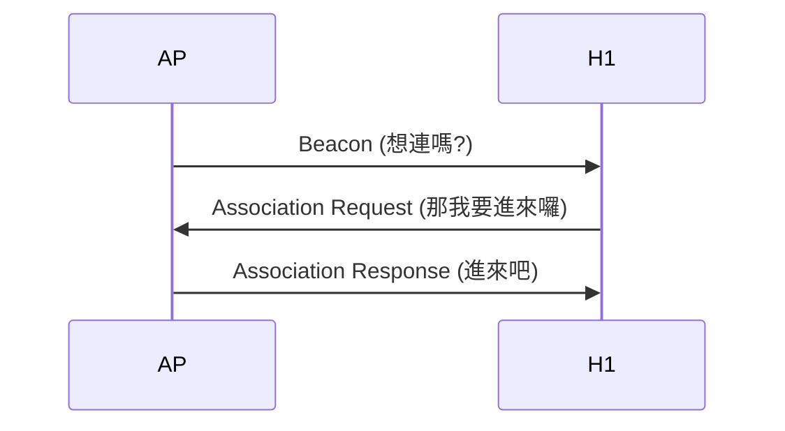
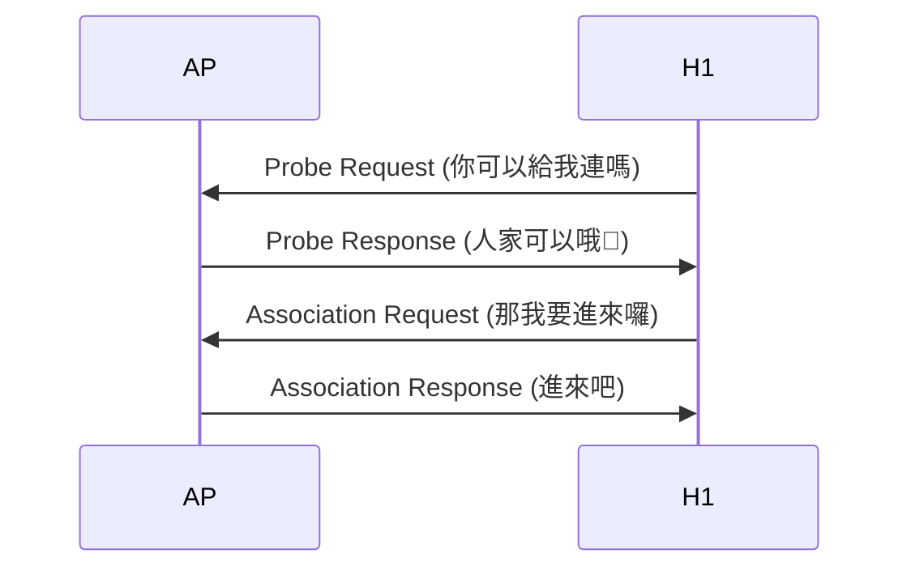
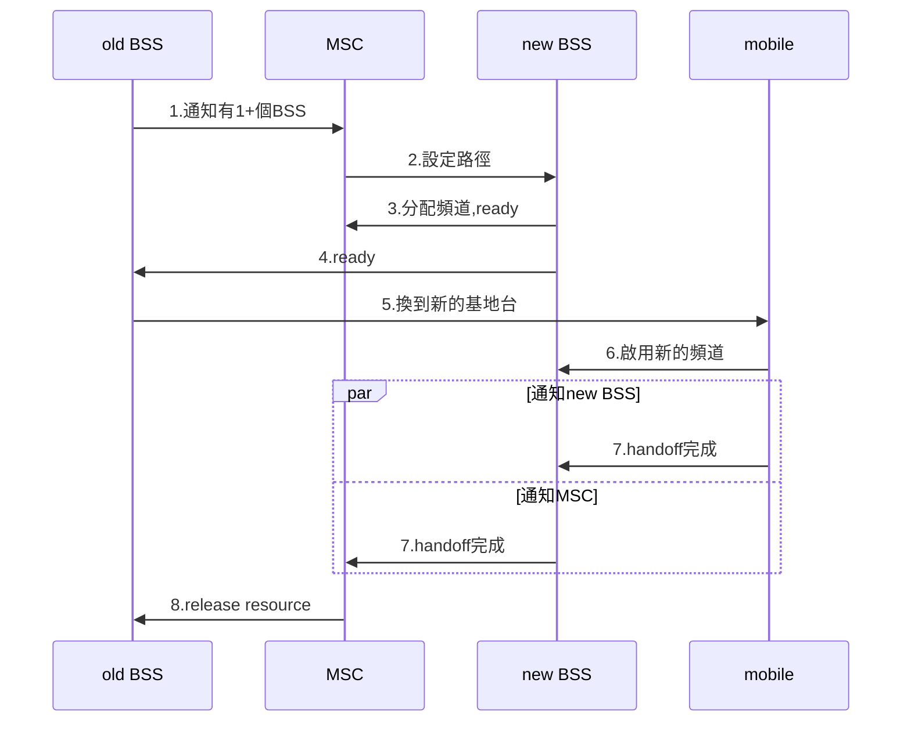

<style>

h1{
    animation-name: bling;
    animation-duration: 5s;
    animation-iteration-count: infinite;
}

@keyframes bling{
    0%  {color: black;}
    10% {color: brown;}
    20% {color: red;}
    30% {color: orange;}
    40% {color: yellow;}
    50% {color: green; }
    60% {color: blue;}
    70% {color: purple;}
    80% {color: gray;}
    90% {color: gold;}
}
/*
p, span,table,svg,li{
    animation-name: shake;
    animation-duration: 5s;
    animation-iteration-count: infinite;
}

@keyframes shake{
    0%  {transform: translate(0px, 0px) rotate(deg);}
    35% {transform: translate(100px, 100px) rotate(0deg);}
    50% {transform: translate(100px, 0px) rotate(0deg);}
    65% {transform: translate(-100px, -100px) rotate(0deg);}
    100% {transform: translate(0px, 0px) rotate(0deg);} 
}
*/
</style>
<!---moz-transform: rotate(90deg);\ 
	-webkit-transform: rotate(90deg);-->
# 數據通訊期末小考精選 - 國立中興大學大資訊工程系 Winter 2020

[](https://hackmd.io/JpgIw0ndRgGDP8xn9yTm0Q/info) [](https://hackmd.io/jZfXixhrTmWPZzYY5IH_fQ)

## 第七次小考 11/9

1. Please list the difference between infrastructure and ad-hoc mode.

    > |                    infrastructure                     |                      ad-hoc                      |
    > |:-----------------------------------------------------:|:------------------------------------------------:|
    > | base station connects <br> mobiles onto wired network | no base station<br> no connect to larger network |
    > 補充：
    > infrastructure: 基礎設施
    > ad-hoc: 源自拉丁文，有隨意的意思 (這種網路是私人小圈圈那種)

2. What is the main difference between wireless mesh network and a mobile ad-hoc network (MANET)?

    > | mesh              | MANET             |
    > | ----------------- | ----------------- |
    > | infrastructure | no infrastructure |
    > |multiple hops|multiple hops|
    > |基地台間以無線方式連結|沒有連接至更大的網路（裝置互聯）|


3. What is hidden terminal problem?

    > ```mermaid
    > graph LR
    >     A ---|hear each other| B ---|hear each other| C
    >     A -. can't hear each other .- C
    > ```
    > 
    > 


4. Please describe the tradeoffs between **S**ignal-to-**N**oise **R**atio and **B**it-**E**rror **R**ate.

    > 固定 physical layer：增加功率 -> 增加SNR -> 降低BER
    > 固定 SNR：改變編碼，調整BER至合適的範圍
    >   
    > 補充：
    > 速度快的通道採用比較低的容錯率
    > 速度慢的通道採用比較高的容錯率
    > SNR 大切換到速度快的通道會導致 BER 上升
    > SNR 小切換到速度慢的通道雖可使 BER 減少，但，就是慢一點
    > 因此必需看情況選擇最合適的通道

5. Please describe the difference between passive and active scanning of 802.11 for SSIDs of access points.

**passive**

由 AP 發送（廣播） beacon (烽火，不是培根)邀請主機來連，主機被動的收到來自 AP 的邀請



**active**

想連線的主機主動發送探針，有一種單身狗徵男女朋友的意味



## 第八次小考 11/16

1. Please describe the operations of CSMA/CA.
    >主機先發送 RTS (request to send) 確定沒有人同時要傳送，AP 回傳 CTS (request to send) 請其他主機不要~~吵~~傳 data 了。開始傳送data，傳送完畢後 AP 傳送 ack ，告訴其他主機可以傳 data 了
    >(1) If channel is idle: 會等待一段DIFS時間（20ms）再傳送
    >(2) If channel is busy: start random backoff time, 並且在偵測到 channel 閒置時就開始倒數
    >(3) While counter=0,transmit entire frame ,and wait for ack.
    >(4) If receiver return ack after SIFS (9ms) (if sender doesn't receive ack, return to step 2)

2. A host can transmit a packet through an 802.11 WiFi AP to a router in the same subnet. Please list the MAC addresses specified in the packet.
    > 
    > :one:   wireless host or AP to receive this frame
    > :two:   wireless host or AP transmitting this frame
    > :three: router interface to which AP is attached
    > :four:  used only in ad hoc mode

3. Please describe the power-management operation of 802.11.
    >AP sleep until next beacon frame
    >beacon frame contain list of mobile with AP-to-mobile frame waiting to be sent 
    >
    >補：
    >node will stay awake if AP-to-mobile frames to be sent; otherwise sleep again and wake up before next beacon frame 

4. Please describe the relationship between care-of-address and permanent address.
    >mobile used both two address
    >permanent address : used by correspondent
    >care-of-address : used by home agent to forward datagrams to mobile (mobile在visited network裡的address)

5. Please describe the operation and drawback of indirect routing for mobility
    >operation: correspondent addresses packets using home address of mobile
    > ->home agent intercepts packets forwards to foreign agent
    > ->foreign agent receives packets, forwards to mobile
    > ->mobile replies directly to correspondent
    >drawback: 需要藉由 home network 來完成通訊，假如 correspondent (發話者) 離 mobile 非常接近，correspondent 也必需透過收話者遠在他方的 home network 來轉接，實在非常沒有效率

## 第九次小考 11/23

1. Please describe the operation and drawback of direct routing for mobility.

    > ```mermaid
    > sequenceDiagram
    >     participant h as home_network
    >     participant c as correspondent
    >     participant v as visited_network
    >     c ->> h: 問位置
    >     h ->> c: 回覆所在的visited netowek
    >     c ->> v: 傳給visited network, routing
    >     v ->> c: mobile 直連
    > ```
    >
    > drawback：
    > correspondent 從 home agent 得到 care-of-address 後，若收話者移動到其他新的 visited network 時會不好處理。
    >
    > 補充：
    > 在 indirect 方法中，當收話者移動到其他新的 foreign network 時 home agent 會得到新的位址，而 correspondent 是透過收話者的 home agent 找到收話者的，所以完全不成問題。但在 direct 方法中，就出現問題了，當收話者在通話時移動，correspondent 根本無從得知(因為 correspondent 並不是透過 home agent 所以根本不知道)。
    > 
    > 解法是透過第一個轉接的 foreign agent，標記為 anchor agent，當收話者離開時，該 foreign agent 會聯絡 new foreign agent，透過此方式來維持與收話者間的聯繫
    > 
    > 這個就是第 4 題在問的東西

2. Which mobility routing is used by mobile IP and cellular networks?

    > indirect routing

3. Please describe the handoff between base stations with common MSC.



4. What is the function of anchor MSC?

    > First MSC visited during call
    > call remains routed through anchor MSC

5. Please describe the difference among streaming stored multimedia, streaming live multimedia, and conversational voice/video over IP.

    > + streaming stored multimedia：
    >     + 在全部下載完以前就可以播放
    >     + 可以以比播放更快的速度傳送（需要buffer）
    > + streaming live multimedia：
    >     + 直播，e.g., twitch, [LineLive](https://live.line.me/channels/2752507)
    > + conversational voice/video over IP:
    >     + 要求高即時性，高互動性

## 第十次小考 11/30

1. Please describe the approach to compensating delay jitter by using client-side buffering
    > 在 buffer 中儲存一定量後再開始播放
    > 


2. Please describe the idea of adaptive playout delay.
    > 1. Estimate network delay, adjust playout delay at beginning of each talk spurt
    > 2. Silent periods compressed and elongated
    > 3. Chunks still played out every 20 msec during talk spurt
    > 
    > fixed playout delay 藉由將初始的playout delay設的夠大，使大多數的封包能夠在預定時間到達，減少封包遺失，但對於 VoIP 而言，希望盡量減少 playout delay。因此希望評估網路的延遲時間與延遲時間的變動程度，動態調整 palyout delay。

3. When can an updated adaptive playout delay be applied to a VoIP session?
    > At the beginning of every talk spurt

4. Please describe a scheme of forward error correction for multmedia packets.
    > 送出較低解析度的音訊串流作為多餘的資訊：
    > 
    > 傳送端會在第 n 個片段後面附上第 n-1 片段的 redundant stream ，每當發生非連續性封包遺失時，接收端都可以透過播放與後續封包一起到達的低位元速率編碼片段，來掩飾封包遺失。
    > 

5. Please list **the functions of** RTP and RTCP
    > RTP: Real time protocol
    > RTCP: Real time control protocol
    >
    > RTP: RTP can be used for transporting sound and video.
    > 
    > 補充： 
    > RTP 會指定好影片或是音訊的封包結構，並且會提供 "payload type", "packet sequence number", "time stamp", "synchronization source identifier", etc.
    >
    > RTCP: RTCP 本身並不傳輸多媒體數據，但和 RTP 一起協作將多媒體數據打包和發送。RTCP is a protocol that works with RTP to monitor data delivery on large multicast networks.
    >
    > 補充：
    > 所有參與 RTP 的連線會週期性的傳送 RTCP 封包給其他所有的參與者。接著 sender 便可使用這些訊息來控制效能。

## 第十一次小考 12/7

1. Please describe the approach of synchronization among streams using RTP and RTCP.
    > There are timestamp fields in each RTP video packets and audio packets. RTCP use these timestamp fields to synchronize.
    >
    > 補充：
    > RTP 處理串流訊號本身，RTCP 同步多個串流訊號以達成影音同步

2. Please define packet marking and policing for QoS.
    >provide protection (traffic isolation) for one class from others 
    >force source adherence to bandwidth allocations
    > <!--當有VoIP使用超過它可用的頻寬時,無效他-->
    > 1. **average rate**: the network may wish to limit the long-term average rate (維持平均流量)
    > 2. **peak rate**: A peak-rate constraint limits the maximum number of packets that can be sent over a shorter period of time. (限制尖峰流量)
    > 3. **max burst size**: The network may also wish to limit the maximum number of packets that can be sent into the network over an extremely short interval of time. (限制瞬間流量高峰)


3. Please describe the operations of token bucket.
    > Before a packet is transmitted into the network, it must first remove a token from the token bucket. If the token bucket is empty, the packet must wait for a token.
    >  
    > 補充：
    > 
    > 1. **average rate**: $r$ packets/s
    > 2. **peak rate**: $rt+b$ packets/s
    > 3. **max burst size**: $b$ packets.

4. Please describe the architecture of differentiated services (DiffServ).
    > 分為 edge router 及 core router
    > edge router: packet classification and traffic conditioning
    > core router: forwarding
    >
    > 補充：
    > Differentiated services 差異式服務
    > 差異式服務的架構設計較為簡單，也比較容易實行。邊緣的路由器(edge router)把網路上的資料流(traffic)用簡化的方式把它分割成不同的分類，這些分類的封包在IP的標頭會有標記(marking)，核心的路由器(core router)只需要轉送，降低負擔。 
    > 
    > + edge router:
    >    + per-flow
    >    + 標記流量是否合法
    > + core router:
    >    + per-class
    >    + 根據 edge router 標記在封包中的資訊來做buffering and scheduling
    >    + in-profile 優先於 out-profile

5. Network security includes four requirements: confidentiality, authentication, message integrity, and access/availability. Please define them
    >機密性：資料不可被第三方取得
    >資料完整性：資料不可被中途竄改或可偵測是否遭竄改
    >可認證性：傳送雙方可互相識別身分
    >~~不可否認性:傳送方不可否認為自己傳送的~~
    >可用性：服務必須對用戶來說是可使用的
    >

## 第十二次小考 12/14

1. How to use public-key cryptography for authentication?
    > The sender uses its private key to encrypt plain text, and then send the **plain text**, **cipher text** and **public key** to receiver. The receiver can use sender's public key to decrypt cipher text. If they are same, sender is real sender, or else it is Trudy.

2. What is session key?


    > session key是雙方傳遞訊息時所使用的對稱式金鑰，會先使用RSA對此金鑰作加密後進行傳遞。
    > 
    
    
3. Please describe the generation of a digital signature.

    <!--**他是問數位簽章而已不是CA**-->

    > Bob: 訊息經過 hash 後用 Bob 的 private key 加密，連同原訊息傳出
    > Alice: 收到之後將原訊息hash，並將加密後的hash用Bob的public key解密，比對兩者
    > 
    > 補充：
    > Web server 向 CA 申請證書，CA 會發回 CA 證書和 private key，web server 端利用 private key 加密自己的資料並附上 CA 證書給 client，client 透過 CA 證書向 CA 獲得 public key，再做解密，看是否確實為該台 web server
    > ```mermaid
    > sequenceDiagram
    > participant A as web server
    > participant C as CA
    > participant B as client
    > 
    > A->>C:註冊帳號
    > C->>A:發數位簽章
    > B->>A:瀏覽網站
    > A->>B:這是我的數位簽章和憑證哦
    > B->>C:給我 public key
    > C->>B:public key
    > ```


     [數位簽章](https://zh.wikipedia.org/wiki/%E6%95%B8%E4%BD%8D%E7%B0%BD%E7%AB%A0)


4. Please describe the operation to get a verified certificate from certification authorities (CA).
    > 1. Server sends client **plain text** and **hashed encrypted text** which is encrypted by a private key that CA distributed to it.
    > 2. Client asks public key via the information in CA certification. Client calculates hashed encrypted text by public key. If these two are same, server is real server. But your girlfriend/boyfriend is still imaginary.
    
5. In Pretty Good Privacy (PGP)<!--到底誰那麼ㄏㄧㄠˊ ㄅㄞ--> email secrecy, message confidentiality, sender authentication and message integrity are assured. Please describe how PGP operates.
    > **confidentiality:** encrypted plain text by a symmetric key **K<sub>s</sub>**. Combined remainder data and encrypt it by receiver's public key.
    >
    > **authentication, message integrity:** hashed the plain text and encrypt it by sender's private key. Receiver can use sender's public key to ensure it is real sender. Besides, if receiver found that the text she/he got and the text she/he calculated are different, then the mail has been tampered.
    > 
    > It is easy to say that 用對稱式加密來加密郵件內容後，再用非對稱式加密之公鑰來加密此對稱式加密的金鑰

---
**知識補給站：**


當 Alice 要寄信給 Bob 時

1. Alice 用一把對稱式金鑰 K<sub>s</sub> 將訊息加密
2. Alice 用 Bob 的 public key K<sub>b</sub><sup>+</sup> 將金鑰 K<sub>s</sub> 加密

Bob 收訊時

1. Bob 用自己的 private key K<sub>b</sub><sup>-</sup> 解出金鑰 K<sub>s</sub>
2. 利用 K<sub>s</sub> 將密文做解密

以上方法有個缺點，Trudy 可以偽裝成 Alice 送信給 Bob，所以 Bob 必需要能確定 Alice 就是 Alice

因此該方法只能實現機密性

當 Alice 要寄信給 Bob 時

1. 將訊息 hash 後用自己的 private key 做加密並與原本的訊息封裝再以對稱式金鑰 K<sub>s</sub> 將訊息加密
2. Alice 用 Bob 的 public key K<sub>b</sub><sup>+</sup> 將金鑰 K<sub>s</sub> 加密

Bob 收訊時

1. Bob 用自己的 private key K<sub>b</sub><sup>-</sup> 解出金鑰 K<sub>s</sub>
2. 利用 K<sub>s</sub> 將密文做解密，得到一組平文，和一個 hash 過並用 Alice 的 private key 加密過的平文；透過 Alice 的 public key 可以將此轉成 hash 後的平文，並將原本的平文 hash 後做比較，如果兩個相同，則代表沒有遭到竄改，並且因為可用 Alice 的 public key 解開被 Alice 的 private 加密後的密文，可以證明是 Alice 傳訊息的

以上方法可以實現機密性和可認證性和資料完整性

---

## 第十三次小考 12/21

1. TCP may suffer from truncation attack. How does SSL avoid truncation attack.
    > 
    > 在 type 欄位中註明此筆紀錄是否用於終止 SSL session，如果user在收到終止SSL 記錄前即收到TCP FIN就知道有truncation attack。
    > 
    > 補充：
    > 簡單來說就是把控制 TCP 連線的訊息一起加密不讓 Trudy 篡改
    > type: 0 for data, 1 for closure
    > 
2. Please list all keys generated in a SSL session.
    > 
    > <!--林子安的圖怎麼那麼低清 -->
    >Eb = 針對 Bob 傳送給 Alice 之資料的會談加密金鑰
    >Mb = 針對 Bob 傳送給 Alice 之資料的會談MAC金鑰
    >Ea = 針對 Alice 傳送給 Bob 之資料的會談加密金鑰
    >Ma = 針對 Alice 傳送給 Bob 之資料的會談MAC金鑰
    >
    > 補充：
    > MAC (Message authentication code) 就是用來確認資料完整性及可認證性用的

3. What is security association used in IPsec?
    >在兩個網路實體之間，所建立起的共享網路安全屬性
    >Before sending data, "security association (SA) "established from sending to receiving entity 從 sender 傳 IPsec datagram 到 receiver 前，sender 和 receiver 會先建立一條網路層的邏輯連線，稱 security association (SA).
    
4. Why does WEP use self synchronized encryption?
    > self-synchronized encryption: 每個封包獨立加密
    > Given encrypted packet and key, can decrypt; can continue to decrypt packets when preceding packet was lost
    > 
    > **在802.11下，封包隨時有可能會掉，封包之間應該要獨立運作**

5. What is the difference between stateless and stateful packet filtering?
    > **stateless**: Stateless firewalls are some of **the oldest firewalls**. They **filter the packets** of incoming traffic distinguishing **between udp/tcp traffic and port numbers**.
    > 
    > **stateful**: Stateful firewalls are a **more advanced, modern extension** of stateless packet filtering firewalls in that they are **continuously able to keep track of the state of the network** and the active connections it has such as TCP streams or user datagram protocol (UDP) communication. 
    >
    > Reference: <https://www.lanner-america.com/blog/stateless-vs-stateful-packet-filtering-firewalls-better/>
    > 
    > ---
    > 
    > 不知道在寫什麼的林子安，然後conxion到底是啥：就圖表裡多一格阿
    > 
    >stateless admit packets that "make no sense"
    >stateful的ACL多了一個check conxion
    >stateful track status of every TCP connection
    >
    >

---

<style>
#author{
    border: 1px solid gray;
    border-radius: 10px;
    padding: 10px;
    width: 80%;
    margin: 10px auto;
}
</style>
<div id="author">
<p>111級中興資工</p>
<p>作者：<a title="瑋哥" href="https://github.com/wei-coding">游庭瑋</a>、<a href="https://github.com/liao2000">廖柏丞</a>、<a title="aka 中興噁男" href="https://github.com/leonardo-lin">林子安</a>、<a title="aka" href="https://github.com/minniemu">穆冠蓁</a>、<a title="教授(連結是twitch哦)" href="https://www.twitch.tv/code1010111">吳俊毅</a></p>
</div>

---