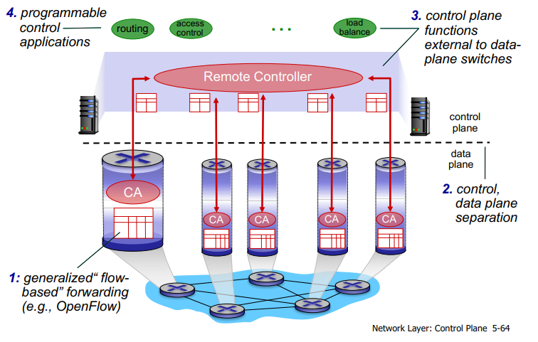
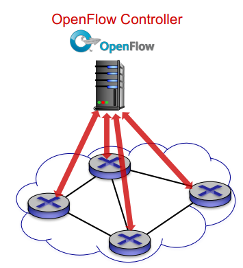
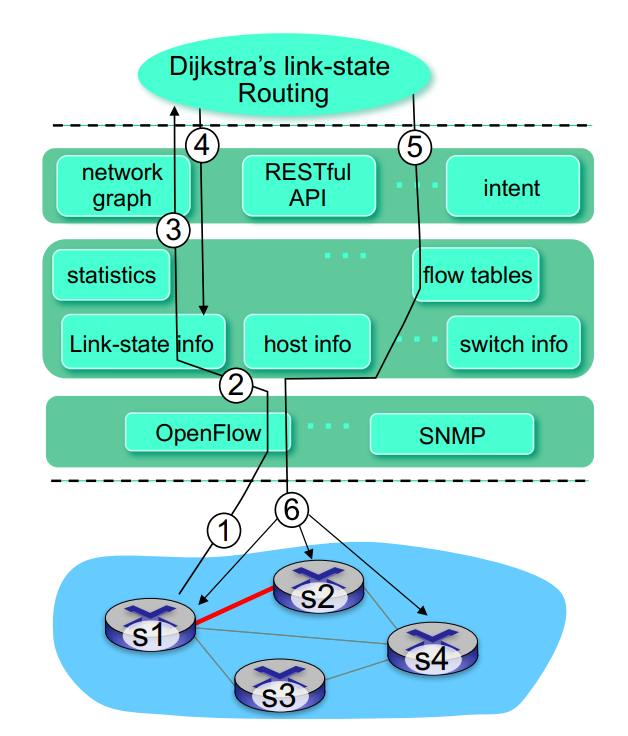
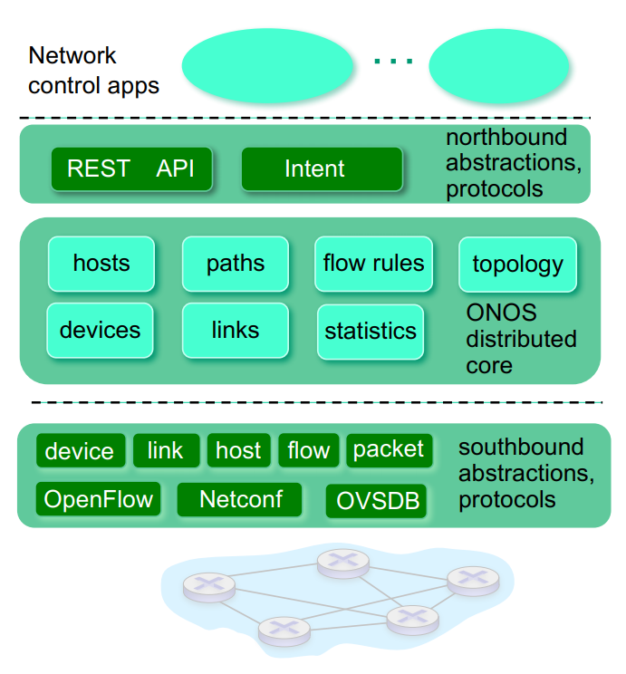

# Chapter5 The Network Layer: Control Plane (cont. 5-5 \~ 5-7)

## 5-5 The SDN Control Plane

Four key characteristics of a SDN architecture can be identified

+ **Flow-based forwarding**.

+ **Separation of data plane and control plane**: The data plane consists of the network's switches -- relatively simple (but fast) devices that execute the "match plus action" rules in their flow tables. The control plane consists of servers and software that determine and manage the switches' flow tables.

+ **Network control functions: external to data-plane switches:** The control plane itself consists of two components

  1. SDN controller (or network OS)

  2. a set of network-control applications.

  The controller maintains accurate network state information; provides this information to the network control applications running in the control plane; and provides the means through devices

+ **A programmable network:** The network is programmable through the network control applications running in the control plane. The applications represent the "brains" of the SDN control plane, using the APIs provided by the SDN controller to specify and control the data plane in the network devices. e.g. a routing network-control application might determine the end-end paths between source and destination.

### Software Define Networking(SDN)

+ 舊方法：Internet network layer: historically has been implemented via distributed, per-router approach

+ 2005年後：Renewed interest in rethinking network control plane

  > **SDN**
  >
  > + easier network management: avoid router misconfigurations, greater flexibility of traffic flows
  >
  > + table-based forwarding (recall OpenFlow API) allows "programming" routers
  >
  >   + **centralized "programming" easier**: compute tables centrally and distribute
  >
  >   + **distributed "programming": more difficul**t, compute tables as result of distributed algorithm implemented in each and every router. 
  >
  > + open implementation of control plane

### SDN perspective: data plane switches

Data plane switches

+ fast, simple, commodity switches implementing generalized data-plane forwarding (Section 4.4) in hardware

+ switch flow table computed installed by controller

+ API for table-based switch control (e.g. OpenFlow)

+ protocol for communicating with controller

### SDN perspective: SDN controller

SDN controller (network OS):

+ maintain network state information

+ interacts with network control applications "above" via northbound API

+ interacts with network switches "below" via southbound API

+ implemented as distributed system for performance, scalability, fault-tolerance, robustness

### SDN perspective: control applications

network-control apps:

+ "brains" of control: implement control functions using lower-level services, API provided by SDN controller

+ unbundled: can be provided by 3rd party: distinct from routing vendor, or SDN controller

### OpenFlow protocol (TCP :6653)

The OpenFlow protocol operates between an SDN controller and an SDN-controlled switch. The OpenFlow protocol operates over TCP 6653.

#### Controller-to-switch messages

+ features: controller queries switch feature, switch replies
+ configure: controller queries/sets switch configuration parameters
+ modify-state: add, delete, modify flow entries in the OpenFlow tables
+ packet-out: controller can send this packet out of specific switch port

#### Switch-to-controller messages

+ packet-in: transfer packet (and its control) to controller.
+ flow-removed: flow table entry deleted at switch
+ port status: inform controller of a change on a port.

> Network operators don't "program" switches by creating/sending OpenFlow messages directly. Instead use higher-level abstraction at controller

#### Example of control/data plane interaction

1. Due to experiencing link failure, S1 uses OpenFlow port status message to notify the controller
2. SDN controller receives OpenFlow message, updates link status info
3. Dijkstra's routing algorithm application has previously registered to be called whenever link status changes, it is called.
4. Dijkstra's routing algorithm access network graph info, link state info in controller, computes new routes

5. Link state routing app interacts with flow-table-computation component in SDN controller, which computes new flow tables needed.
6. Controller uses OpenFlow to install new tables in switches that need updating.

### OpenDaylight (ODL) controller

+ OpenDaylight: ODL Lithium controller
+ network apps may be contained within, or be external to SDN controller
+ Service Abstraction Layer: interconnects internal, external applications and services
+ control apps separate from controller
+ internet framework: high-level specification of service: what rather than how
+ considerable emphasis on distributed core: service reliability, replication performance scaling

## 5-6 ICMP: The Internet Control Message Protocol

ICMP is used by hosts and routers to communicate network-layer information to each other. The most typical use of ICMP is for error reporting.

ICMP is often considered part of IP, but architecturally it lies just above IP, as ICMP messages are carried inside IP datagrams. That is, ICMP messages are carried as IP payload. (也就是說 ICMP 和 UDP, TCP 算同一種) (IP 封包中 Upper layer = 1 代表 ICMP = 6 代表 TCP = 17 代表 UDP)

### ping

The well-known ping program sends an ICMP **type 8 code 0 message to the specified host.** The destination host, seeing the echo request, sends back a **type 0 code 0 ICMP echo reply**.

### Traceroute

Traceroute is implemented with ICMP messages. Traceroute in the source sends a series of ordinary IP datagrams to the destination. Each of these datagrams carries a UDP segment with an unlikely UDP port number. The first of these datagrams has a TTL of 1, the second of 2, the third of 2, and so on. The source also starts timers for each of the datagrams. When the *n*th datagram arrives at the *n*th router, the *n*th router observes that the TTL of the datagram has just expired,.

According to the rule of the IP protocol, the router discards the datagram and sends an ICMP warning message to the source (**type 11 code 0**). This warning message includes the name of the router and its IP address. When traceroute source arrives destination, the destination host sends a port unreachable ICMP message **(type3 code 0)**.

## 5-7 Network Management and SNMP

`TODO`