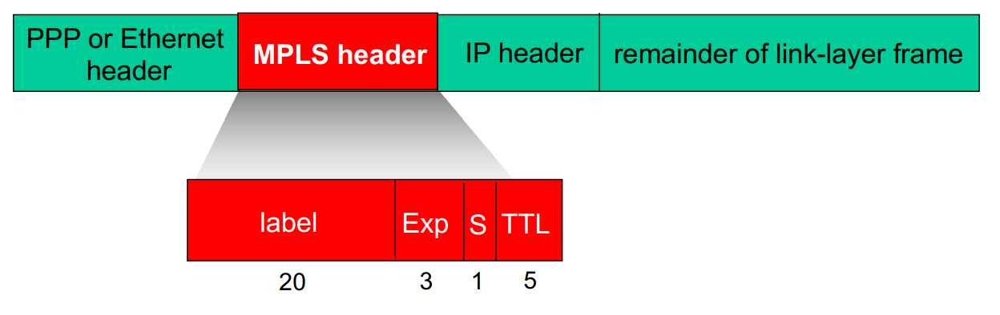
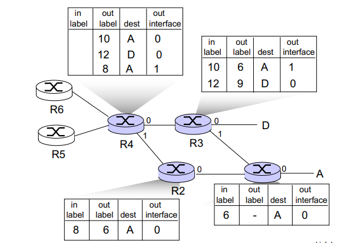

# Chapter6 The Link Layer and LANs (cont. 6-5 \~ 6-7)

## 6-5 Link Virtualization: A Network as a Link Layer

### Multiprotocol Label Switching (MPLS) a.k.a. label-switched router

> The goal of MPLS was not to abandon the destination-based IP datagram, but to augment it by selectively labeling datagrams and allowing routers to forward datagrams based on fixed-length labels.
>
> 1. fast lookup using fixed length identifier (rather than shortest prefix matching)
> 2. borrowing ideas from Virtual Circuit (VC) approach
> 3. IP datagram still keeps IP address

Let's begin our study of MPLS by considering the format of a link-layer frame that is handled by an MPLS-capable router.

Forward packets to outgoing interface based only on label value (don't inspect IP address). MPLS forwarding table distinct from IP forwarding tables

flexibility: MPLS forwarding decisions can differ from those of IP. Use destination and source address to route flows to same destination differently. Re-router flows quickly if link fails: pre-computed backup paths (useful for VoIP)

**MPLS vs IP paths**

IP

> Path to destination determined <mark>by destination address only</mark>

MPLS

> Path to destination can <mark>be based on source and destination address</mark>
>
> fast reroute: precompute backup routes in case of link failure

 **MPLS signaling**

Modify OSPF, IS-IS link-state flooding protocols to carry info used by MPLS routing

Entry MPLS router uses RSVP-TE signaling protocol to set up MPLS forwarding at downstream routers.

Example:

Router R1 through R4 are MPLS capable. R5 and R6 are standard IP router. R1 has advertised to R2 and R3 that it (R1) can route to destination A, and that received frame with MPLS label 6 will be forwarded to destination A. Router R3 has advertised to router R4 that it can route to destinations A and D, and that incoming frames with MPLS labels 10 and 12, respectively, will be switched toward those destinations. Router R2 has also advertised to router R4 that it (R2) can reach destination A, and that a received frame with MPLS label 8 will be switched toward A.

## 6-6 Data Center Networking

load balancer: application-layer routing

+ receives external client requests
+ directs workload within data center
+ returns results to external client(hiding data center internals form clients)

rich interconnection among switches, racks:

+ increased throughput between racks (multiple routing paths possible)
+ increased reliability via redundancy

## 6-7 Retrospective: A Day in the Life of a Web Page Request

**scenario**

> student attaches laptop to campus network, requests/receives www.google.com

+ connecting laptop needs to get its own IP address, address of first-hop router, address of DNS server: use **DHCP** (Dynamic Host Configuration Protocol, 動態主機配置協議)

+ DHCP request encapsulated in UDP, encapsulated in IP, encapsulated in 802.3 Ethernet

+ Ethernet frame broadcast (destination: FFFFFFFFFFFF) on LAN, received at router running DHCP server

+ Ethernet demuxed to IP demuxed, UDP demuxed to DHCP

+ DHCP server formulates(制定) **DHCP**, **ACK** containing client's IP address, IP address of first-hop router for client, name & IP address of DNS server

+ encapsulation at DHCP server, frame forwarded (switch learning) through LAN, demultiplexing at client.

+ DHCP client receives DHCP ACK reply

  > Client now has IP address, known name & address of DNS server, IP address of first-hop router

+ before sending **HTTP** request, need IP address of www.google.com: DNS
+ DNS query created, encapsulated in UDP, encapsulated in IP, encapsulated in Ethernet. <u>To send frame to router, need MAC address of router interface: **ARP**</u>

+ **ARP query** broadcast, received by router, which replies with **ARP reply** giving MAC address of router interface
+ client now knows MAC address of first hop router, so can now send frame containing DNS query

+ IP datagram contains DNS query forwarded via LAN switch from client to first hop router.
+ IP datagram forwarded **from campus network into Comcast network**, routed (tables created by RIP, OSPF, IS-IS and/or BGP routing protocols) to DNS server

+ demuxed to DNS server
+ DNS server replies to client with IP address of www.google.com
+ to send HTTP request, client first opens TCP socket to web server.
+ TCP **SYN** segment inter-domain routed to web server
+ web server responds with TCP **SYNACK**
+ TCP **connection established**!
+ HTTP request sent into TCP socket
+ IP datagram containing HTTP request to www.google.com
+ web server responds with HTTP **reply (containing web page)**

+ IP datagram containing HTTP reply routed back to client