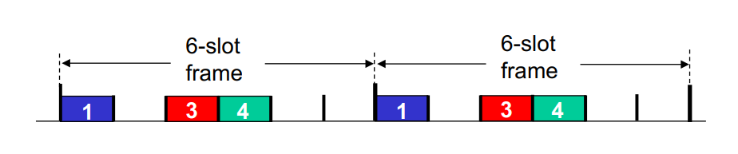
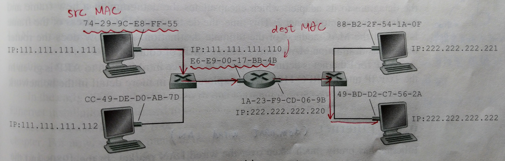

# Chapter6 The Link Layer and LANs

## 6-1 \~ 6-4

## 6-1 Link layer and LANs

nodes: hosts and routers.

links: communication channels that connect adjacent nodes along communication path

> + wired links
> 
> + wireless links
> 
> + LANs

> **data-link layer** has responsibility of transferring datagram **from one node to physically adjacent node** over a link

**link layer services**

+ framing, link access:
  
  + encapsulate datagram into frame, adding **header**, **trailer**
    
    + header:
    
    + trailer: e.g. check bit
  
  + channel access if shared medium
  
  + "MAC" address used in frame headers to identify source, destination
    
    + different from IP address

+ reliable delivery between adjacent nodes
  
  + seldom used on low bit-error link
  
  + wireless links: high error rates

+ flow control
  
  + packing between adjacent sending and receiving nodes

+ error detection
  
  + errors caused by signal attenuation, noise
  
  + receiver detects presence of errors

+ error correction
  
  + receiver identifies and corrects bit errors without resorting to retransmission.

+ half-duplex and full-duplex
  
  + with half duplex, nodes at both ends of link can transmit, but not at same time

**Where is the link layer implemented?**

+ in each and every host

+ link layer implemented in "adaptor" (aka network interface card, NIC) or on a chip
  
  + Ethernet card, 802.11 card: Ethernet chipset
  
  + implements link, physical layer

+ attaches into host's system buses

+ combination of hardware, software, firmware

+ sending side:
  
  + encapsulates datagram in frame
  
  + adds error checking bits, rdt(reliable data transfer), flow control, etc.

+ receiving side:
  
  + looks for errors, rdt(reliable data transfer), flow control, etc.
  
  + extracts datagram, passes to upper layer at receiving side.

## 6-2 Error detection, correction

Error detection not 100% reliable!

+ protocol may miss some errors, but rarely

+ larger EDC fields yields better detection and correction

EDC: Error Detection and Correction bits

### Parity checking

**single bit parity**

detect single bit error

e.g.

> original: 0111000110101011
> 
> parity: 0 xor 1 xor 1 xor 1 xor 0 ... = 1

**two-dimensional bit parity**

### Internet checksum

**goal:** detect "errors" (e.g. flipped bits) in transmitted packet (note: used at transport layer only)

**sender:** 

+ treat segment contents as <u>sequence of 16-bit integers</u>

+ checksum: addition (1's complement sum) of segment contents
  
  + 進位的數也要加
  
  + [詠網直前: 計算TCP/IP Checksum](http://bruce690813.blogspot.com/2017/09/tcpip-checksum.html)

+ sender puts checksum value into UDP checksum field

**receiver:**

+ compute checksum of received segment

+ check if computed checksum equals checksum field value

### Cyclic redundancy check

+ more powerful error-detection coding

+ view data bits, D, as a binary number

+ choose r+1 bit pattern (generator), G

+ choose r CRC bits, R, s.t.
  
  + <D, R> exactly divisible by G (modulo 2)
  + receiver knows G, divides <D, R> by G. if non-zero remainder: error detected!

+ widely used in practice (Ethernet, 802.11 WiFi, ATM)

+ CRC example:

> G = 1001
> 
> D = 101110
> 
> R = ?

## 6-3 Multiple access protocols

Two types of "links":

1. point-to-point
2. broadcast (shared wire or medium)
   + old-fashioned Ethernet
   + upstream HFC
   + 802.11 wireless LAN

Multiple access protocol

+ distributed algorithm that determines how nodes share channel, i.e., determine when node can transmit
+ communication about channel sharing must use channel itself!
  + no out-of-bound channel for coordination

### MAC protocols: taxonomy (分類)

three board classes:

1. channel partitioning
   + divide channel into smaller "pieces" (time slots, frequency, code)
   + allocate piece to node for exclusive use
2. random access
   + channel not divided, allow collisions
   + "recover" from collisions
3. taking turns
   + nodes take turns, but nodes with more to send can take longer turns (但是可能需要更多訊息的節點)

#### 1.1 Channel partitioning MAC protocols: TDMA

**TDMA: time division multiple access**

+ access to channel in "rounds"
+ each station gets fixed length slot (length = packet transmission time) in each round
+ unused slots go idle
+ e.g. 6-station LAN, 1,3,4 have packets to send, slots 2,5,6 idle

#### 1.2 Channel partitioning MAC protocols: FDMA

**FDMA: frequency division multiple access**

+ channel spectrum(頻譜) divided into frequency bands
+ each station assigned fixed frequency band
+ unused transmission time in frequency band go idle
+ e.g. 6-station LAN, 1,3,4, have packet to send, frequency bands 2,5,6 idle

#### 2. Random access protocols

+ when node has packet to send
  + transmit at full channel data rate R.
  + no a priori coordination among nodes
+ two or more transmitting nodes -> "collision"
+ random access MAC protocol specifies:
  + how to detect collisions
  + how to recover from collisions.
+ examples of random access MAC protocols:
  + slotted ALOHA
  + ALOHA
  + CSMA, CSMA/CD, CSMA/CA

### 2.1 Slotted ALOHA

**assumptions:**

1. all frames same size
2. time divided into equal size
3. nodes start to transmit only slot beginning
4. nodes are synchronized
5. if 2 or more nodes transmit in slot, al nodes detect collision

**operation:**

when node obtains fresh frame, transmits in next slot

+ if no collision: node can send new frame in next slot
+ if collision: node retransmits frame in each subsequent slot with prob. p until success

**pros:**

+ single active node can continuously transmit at full rate of channel
+ highly decentralized
+ simple

**cons:**

+ collisions, wasting slots
+ idle slots
+ nodes may be able to detect collision in less than time to transmit packet
+ clock synchronization

**Efficiency:**

+ max efficiency: 37%

### 2.2 Pure ALOHA

unslotted ALOHA: simple, no synchronization

collision probability increases

**efficiency:**

+ max efficiency: 18%

### 2.3 CSMA/CD

**CSMA: carrier sense multiple access.** Listen before transmit

+ if channel sensed idle: transmit entire frame
+ if channel sensed busy: defer transmission
+ human analogy: don't interrupt others

### 3.1 Taking Turns (polling)

> The polling protocol requires one of the nodes to be designated as a master node. The master node polls each of the nodes in a round-robin fashion.
>
> In particular, the master node first sends a message to node 1, saying that it can transmit up to some maximum number of frames. After node 1 transmits some frames, the master node tells node 2 can transmit up to the maximum number of frames.

+ master node "invites" slave nodes to transmit in turn

+ typically used with "dumb" slave devices

concerns:

+ polling overhead (輪詢開銷)
+ latency (延遲)
+ single point of failure (master) 

### 3.2 Taking Turns (token passing)

> In this protocol **there is no master node**. A small, special-purpose frame knows as a token is exchanges among the nodes in some fixed order. Over the years many token-passing protocols have been developed, including the fiber distributed data interface (FDDI 光纖) protocol, and the IEEE 802.5 token ring (權仗環) protocol. 另外藍牙也是採用 token 

**concerns**

+ token overhead (token 傳送一輪開銷)
+ latency (延遲)
+ single point of failure (token) 

### DOCSIS: The Link-Layer Protocol for Cable access network

Cable access network typically connects several thousand residential cable modems to a **c**able **m**odems **t**ermination **s**ystem (CMTS) AT THE CABLE NETWORK HEADEND.

The Data-Over-Cable Service Interface Specifications (DOCSIS) specifies the cable data network architecture and its protocols. **DOCSIS uses FDM to divide the downstream (CMTS to modem) and upstream (modem to CMTS) network segments into multiple frequency channels**.

Since there is just a single CMTS transmitting into the downstream channel, there is no multiple access problem

The upstream direction, however, is more interesting and technically challenging, since multiple cable modems share the same upstream channel (frequency) to the CMTS.

The CMTS explicitly grants permission to individual cable modems to transmit during specific mini-slots. The CMTS accomplishes this by sending a control message known as a MAP message on a downstream channel to specify which cable modem can transmit during which mini-slot for the interval of time specified in the control message.

How does the CMTS know which cable modems have data to send in the first place? This is accomplished by having cable modems send **mini-slot-request** frames to the CMTS during a special set of interval mini-slots that are dedicated for this purpose. These **mini-slot-request frames are transmitted in a random access** manner and so may collide with each other. A cable modem can neither sense whether the upstream cannel is busy nor detect collision. Instead, the cable modem infers that its mini-slot-request frame experienced a collision if it does not receive a response to the requested allocation in the next downstream control message. (cable modem 無法感知是否忙線或發生碰撞，只能等到下次 downstream 看看有沒有收到 control message)

When a collision is inferred, a cable modem uses binary exponential backoff to defer the retransmission

## 6-4 LANs

### MAC addresses

MAC: Media Access Control 又稱 Ethernet address

+ 32-bit IP address:
  + network-layer address for interface
+ MAC (or LAN or physical or Ethernet) Address:
  + 48 bit MAC address (for most LANs) burned in NIC ROM, also sometimes software settable
  + e.g.: 1A-2F-BB-76-09-AD

### LAN addresses

Each adapter on LAN has unique LAN address

MAC address allocation administered by IEEE

manufactures buys portion of MAC address space (to assure uniqueness)

+ MAC: flat address → portable
+ IP: hierarchical address → not portable

### APR: address resolution protocol

> Because there are both network-layer address and link-layer address, there is a need to translate between them. For the Internet, this is the job of the Address Resolution Protocol (APR)
>
> 思考一下，如果現在有一個 LAN ，LAN 內的網路共用一台 Switch 和一台 Router
>
> 其中一台電腦 222.222.222.220 想要傳送訊息給 222.222.222.222 ，透過 Router 傳送封包後會傳回同一個子網路中，這時要靠 switch 去傳，switch 要怎麼傳？switch 靠的就是 MAC address，但是我只知道 222.222.222.220 這個 IP 而不知道這個 IP 所對應的 MAC address

*A* wants to send datagram to *B*

1. *A* broadcasts ARP query packet, containing *B'S* IP address.
2. *B* receives ARP packet replies to *A* with its MAC address
3. *A* cashes IP-to-MAC address pair in its ARP table until information becomes old
4. ARP is "plug-and-play"

**ARP table**

**Each host and router has an ARP table** in its memory, which contains mappings of IP addresses to MAC address. The ARP table also contains a TTL value, which indicates when each mapping will be deleted from the table. Note that a table does not necessarily contain an entry for every host and router on the subnet.

> 1. MAC address
> 2. IP address
> 3. TTL

**How it works?**

> Now suppose that host 222.222.222.220 wants to send a datagram that is IP-addressed to another host or router on that subnet(e.g. 222.222.222.222). The sending host needs to obtain the MAC address of the destination given the IP address.
>
> This task is easy if the sender's ARP table has an entry for the destination node. But what if the ARP table doesn't currently have an entry for the destination?
>
> First, the sender constructs a special packet called an **ARP packet**. An ARP packet has several fields, including the sending and receiving IP and MAC address. Both ARP query and response packets have the same format. The purpose of the ARP query packet is to query all the other hosts and routers on the subnet to determine the MAC address corresponding to the IP address that is being resolved.
>
> 222.222.222.220 passes an ARP query packet to the adapter along with an indication that the adapter should send the packet to the MAC **broadcast address** FF-FF-FF-FF-FF-FF. The adapter encapsulates the ARP packet in a link-layer frame, uses the broadcast address for the frame's destination address, and transmits the frame into the subnet.
>
> The frame containing the ARP query is received by all the other adapters on the subnet. Each of these ARP modules checks to see if its IP address matches the destination IP address in the ARP packet. The one with a match (222.222.222.222) sends back to the querying host a response ARP packet with the desired mapping. The querying host 222.222.222.220 can then update its ARP table and send its IP datagram, encapsulated in a link-layer frame whose destination MAC is that of the host or router responding to the earlier ARP query.
>
> **Note that**
>
> 1. the query ARP message is sent within a broadcast frame, whereas the response ARP message is sent within a standard frame.
> 2. ARP is plug-and-play.

**Sending a Datagram off the subnet**

當 111.111.111.111 要算封包給 222.222.222.222 時封包中的 destination MAC address 並不是 222.222.222.222 的 MAC address 而是 next-hop router E6-E9-00-17-BB-4B

### Ethernet

"dominant" wired LAN technology

+ single chip, multiple speeds
+ first widely used LAN technology
+ simpler, cheap
+ kept up with speed rate: 10Mbps - 10Gbps

**physical topology**

1. bus
   
   > all nodes in same collision domain (can collide with each other)
   > 
   > bus 是早期的接法如中間有斷

2. star
   
   > active **switch** in center
   > 
   > each "spoke" runs a separate Ethernet protocol (nodes do not collide with each other)

**Ethernet frame structure**

+ preamble (8 bytes)

  > 10101010 * 7 + 10101011
  >
  > used to synchronize receiver, sender clock rates

+ dest. address & src. address (each one are 6 bytes)

  > 6 bytes source, destination MAC address e.g. AA-AA-AA-AA-AA-AA
  >
  > + if adapter receives frame **with matching destination address**, or with broadcast address (e.g. ARP packet), it **passes data in frame to network layer protocol**.
  > + otherwise, adapter discards frame

+ type: (2 bytes)

  > indicates higher layer protocol
  >
  > IPv4: 0x0800
  >
  > ARP: 0x0806

+ CRC: (8 bytes)

  > cyclic redundancy check at receiver

**Unreliable, connectionless**

+ connectionless: no handshaking between sending and receiving NICs (NIC, network interface card)
+ unreliable: receiving NIC doesn't send ACKs or NACKs to sending NIC

### Link-Layer Switches

To understand how switch filtering and forwarding work, suppose a frame with destination address DD-DD-DD-DD-DD-DD arrives at the switch on interface x. The switch indexes its table with the MAC address DD-DD-DD-DD-DD-DD. There are three possible cases:

+ There is no entry in the table for DD-DD-DD-DD-DD-DD. In this case, the switch forwards copies of the frame to the output buffers preceding all interfaces except for interface x. (switch 複製該封包給所有除了 x 之外的接口)
+ There is an entry in the table, associating DD-DD-DD-DD-DD-DD with interface x. In this case, the frame is coming from a LAN segment that contains adapter DD-DD-DD-DD-DD-DD. There being no need to forward the frame to any of the other interfaces, the switch performs the filtering function by discarding the frame.
+ There is an entry in the table, associating DD-DD-DD-DD-DD-DD with interface y (y is not equal to x). In this case, the frame needs to be forwarded to the LAN segment attached to interface y. The switch performs its forwarding function by putting the frame in an output buffer that precedes interface y.

**Self-Learning**

A switch has the wonderful property that its table is build automatically, dynamically, and autonomously -- without any intervention from a network administrator or from a configuration protocol.

1. The switch table is initially empty

2. For each incoming frame received on the interface

   1. the MAC address in the frame's source address field
   2. the interface from which the frame arrived
   3. the current time

   > If every host in the LAN eventually sends a frame, then every host will eventually get recorded in the table.

3. The switch deletes an address in the table if no frames are received with that address as the source address after some period of time. In this manner, if a PC is replaced by another PC, the MAC address of the original PC will eventually be purged from the switch table.

| Address              | Interface | Time |
| :------------------- | :-------: | :--: |
| 01-12-23-34-56       |     2     | 9:39 |
| AA-BB-CC-DD-EE-FF-00 |     1     | 9:32 |
| ...                  |    ...    | ...  |

Switches are plug-and-play devices because they requires no intervention from a network administrator or user (i.e., switch 是 layer-2 的裝置). Switches are also full-duplex, meaning any switch interface can send and receive at the same time.

**Switches vs Routers**

+ both are store-and-forward

+ both have forwarding table

Whereas a router is a layer-3 packet switch, a switch is a layer-2 packet switch.

First consider the pros and cons of switches.

> pros:
>
> + plug-and-play
> + relatively high filtering and forwarding rates (因為只要解到第2層, 不像 router 要解到第3層)
>
> cons:
>
> + prevent the cycling of broadcast frames
> + a large switched network would require large ARP tables
> + susceptible to (容易被...影響) broadcast storms

Second consider the pros and cons of routers.

> pros:
>
> + packets do not normally cycle through routers
> + Routers have allowed the Internet to be build with a rich topology because they do not have the spanning tree restriction
> + Routers provide firewall protection against layer-2 broadcast storms
>
> cons:
>
> + NOT plug-and-play
> + Often have a larger per-packet processing time than switches because they have to process up through the layer-3 fields

|                   | Hubs | Routers | Switches |
| ----------------- | ---- | ------- | -------- |
| Traffic isolation | No   | Yes     | Yes      |
| Plug and play     | Yes  | No      | Yes      |
| Optimal routing   | No   | Yes     | No       |

### Virtual Local Area Networks (VLANs)

為什麼需要 VLAN, 如果每個 LAN 都各自有一個 Switch 會怎麼樣

1. **Lack of traffic isolation**. Although the hierarchy localizes group traffic to within a single switch, broadcast traffic must still traverse the entire institutional network.
2. **Inefficient use of switches**. If the institution had a 10 small groups (each group is less than 10 people), then a single 96-port switch would likely be large enough to accommodate every one, but this single switch would not provide traffic isolation.
3. Managing users. If an employee moves between groups, the physical cabling must be changed to connect the employee to a different switch.

Fortunately, each of these difficulties can be handled by a switch that supports **virtual local are networks (VLANs)**.

**port-based VLAN:**

**VLAN spanning multiple switches**

> **trunk port:** carries frames between VLANs defined over multiple physical switches
>
> + frames forwarded within VLAN between switches can't be vanilla 802.1 frames (must carry VLAN ID info)
> + 802.1Q protocol adds/removed additional header fields for frames forwarded between trunk ports

