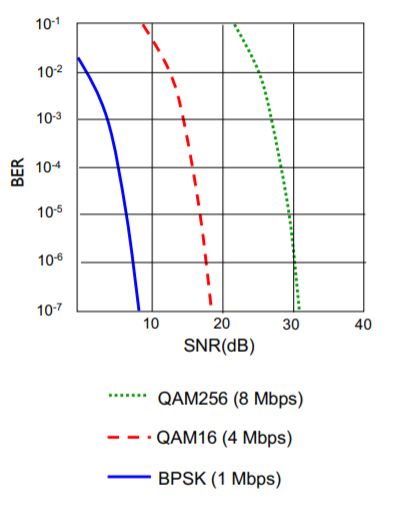
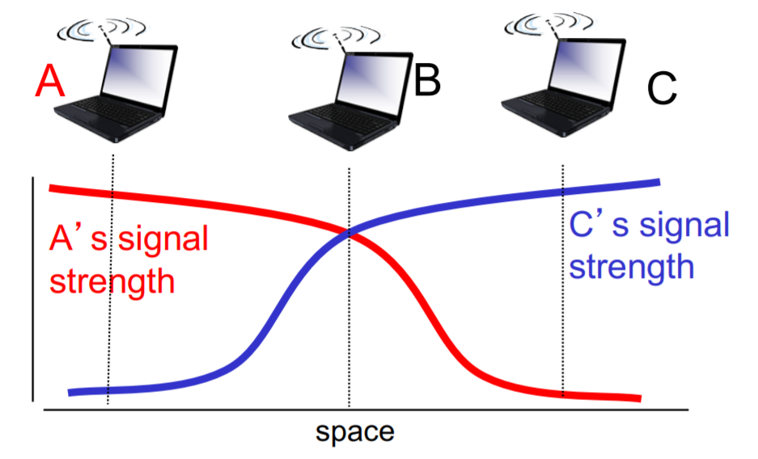
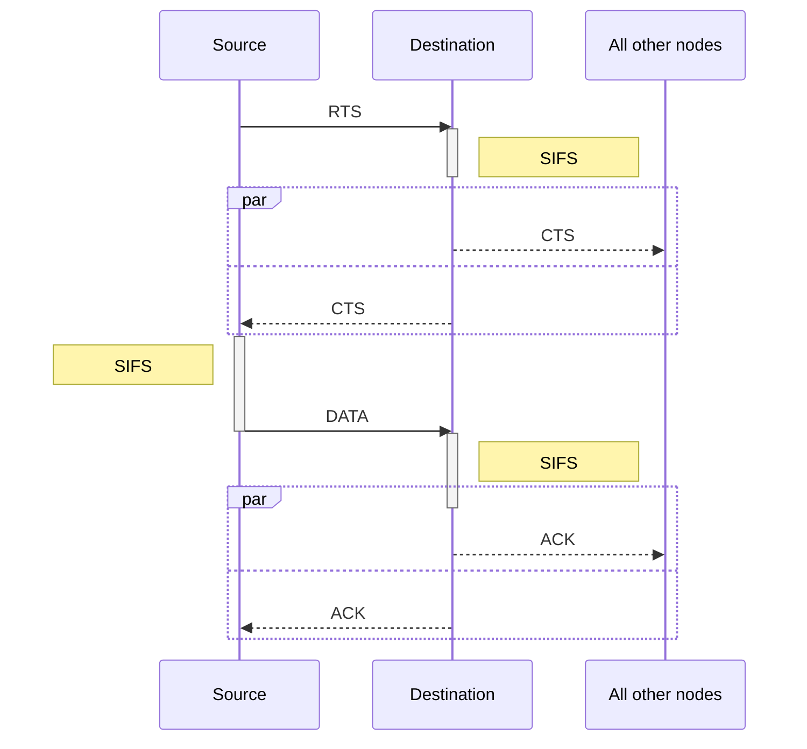
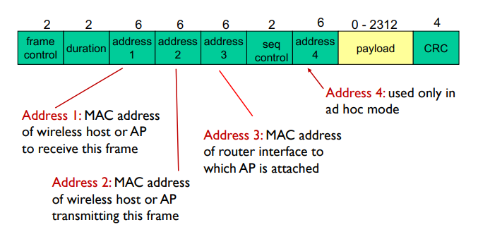
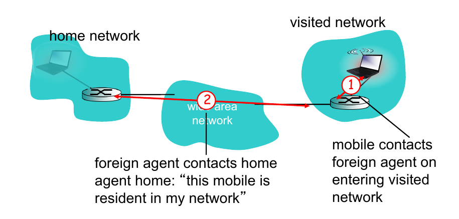
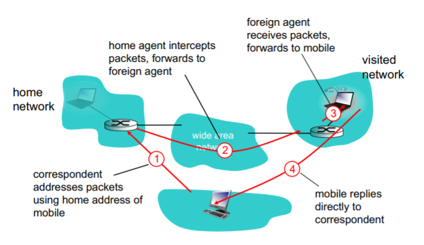
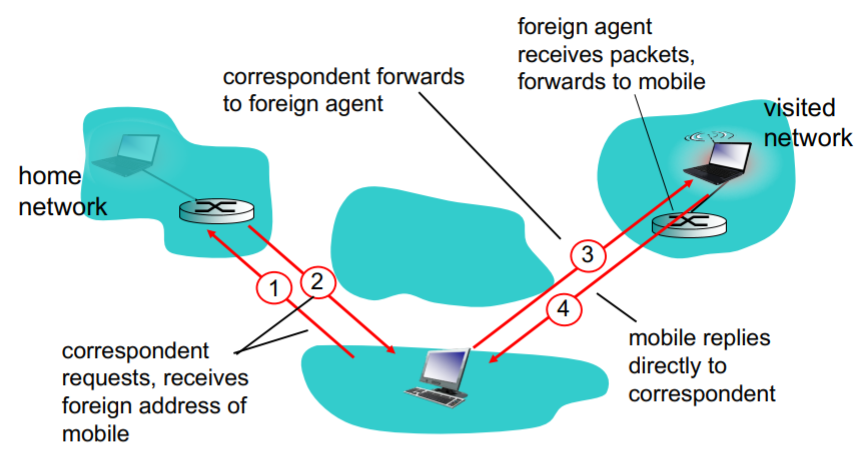
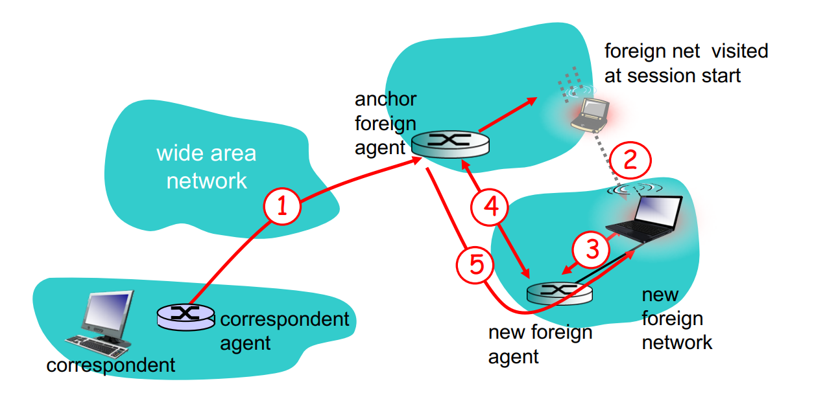
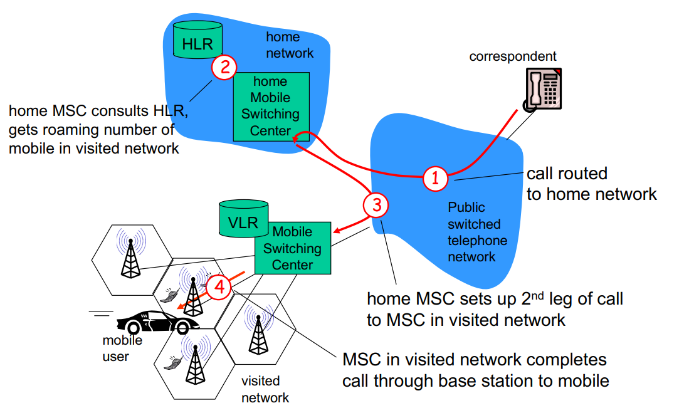

# Chapter7 Wireless and Mobile Networks

## 7-1 Introduction

**wireless network taxonomy**

|                   | single hop                                                                 | multiple hops                                                                                  |
| ----------------- | -------------------------------------------------------------------------- | ---------------------------------------------------------------------------------------------- |
| infrastructure    | host connects to base station (WIFI, WiMAX, cellular)                      | host may have to relay through several wireless nodes to connect to larger Internet (mesh net) |
| no infrastructure | no base station, no connection to larger Internet (Bluetooth, ad hoc nets) | no base station, no connection to larger Internet (MANET, VANET)                               |

*ad hoc:* 無線隨意網路, ad hoc 源自拉丁文，意思是臨時、專用、特設的。ad hoc network 由節點與節點間的動態連結所形成。它不需要依賴一個既存的網路架構

*mesh net:* 網狀網路，是一種在網路節點間透過動態路由的方式來進行資料與控制指令的傳送。這種網路可以保持每個節點間的連線完整，當網路拓蹼中有某節點失效或無法服務時，這種架構允許使用「跳躍」的方式形成新的路由後將訊息送達傳輸目的地。 Reference: [網狀網路-維基百科](https://zh.wikipedia.org/wiki/%E7%BD%91%E7%8A%B6%E7%BD%91%E7%BB%9C)

*MANET:* 隨建即連網路 (Mobile ad hoc network) 通過無線連結，自我組態所形成的網路 Reference: [隨建即連網路-維基百科](https://zh.wikipedia.org/wiki/%E9%9A%A8%E5%BB%BA%E5%8D%B3%E9%80%A3%E7%B6%B2%E8%B7%AF)

*VANET:* 車載隨意行動網路(Vehicular ad-hoc network)

## 7-2 Wireless links characteristics

important difference from wired link

+ decreased signal strength
+ interference from other sources: standardized wireless network frequencies (e.g., 2.4GHz) shared by other devices (e.g., phone)
+ multipath propagation: radio signal reflects off objects ground, arriving ad destination at slightly different rimes

### SNR v.s. BER tradeoffs

SNR: signal-to-noise ratio (越大表示雜訊越少)

BER: bit error rate

Dynamic selection of the physical-layer modulation technique can be used to adapt the modulation technique to cannel conditions.

當 SNR 較大時，切換到速度比較快的通道

### Hidden terminal Problem

+ A, B hear each

+ B, C hear each

+ **A, C can not hear each other** means A,C unaware of their interference at B

### CDMA (code division multiple access)

因為天線很難像 Ethernet 做全雙工所以不是 CSMA/CD (carrier sense multiple access/ collision detection) 而且還有 hidden terminal 的問題

802.11 只能做到 CA (collision avoidance)

## 7-3 IEEE 802.11

802.11b: 2.4GHz - 2.485CHz spectrum divided into 11 channels at different frequencies

+ AP admin chooses frequency for AP
+ interference possible: channel can be same as that chosen by neighboring AP

**802.11 passive/active scanning**

passive scanning: (一般常用)

1. beacon frames sent from APs
2. association request frame sent: Host to selected AP
3. association response frame sent from selected AP to Host

active scanning: (小氣的同學)

1. probe request frame broadcast from Host
2. probe response frames sent from APs
3. association request frame sent: Host to selected AP
4. association response frame sent from selected AP to Host

### The 802.11 MAC protocol

#### CA (Collision Avoidance) RTC-CTS exchange

RTS: Request to send

CTS: clear to send

#### 802.11 Addressing

## 7-4 Cellular Internet Access

### Component

+ base station
+ mobile users
+ air-interface
+ MSC (Mobile switch center): connects cell to wired telephone net

## 7-5 Principles: addressing and routing to mobile users

What is mobility?

> + no mobility: mobile wireless user, using same access point
> 
> + low mobility: mobile user, connecting/disconnecting from network using DHCP.
> 
> + high mobility: mobile user, passing through multiple access point while maintaining ongoing connections (like cellphone)

### Approaches

1. let routing handle it. **too complex**

2. let end-system handle it.
   
   1. indirect routing
   
   2. direct routing

### Registration

> visited user 向 visited network 註冊
> 
> 

### Indirect routing

mobile use two addresses:

1. permanent address: used by correspondent (通訊者)
2. care-of-address (COA): Foreign agent create COA for the mobile node. It is used by home agent to forward datagrams to mobile

communication from correspondent to mobile goes through home agent, then forwarded to remote

drawback: 

> 需要藉由 home network 來完成通訊，假如 correspondent (發話者) 離 mobile 非常接近，correspondent 也必需透過收話者遠在他方的 home network 來轉接，實在非常沒有效率

### Direct routing

correspondent gets foreign address of mobile, sends directly to mobile

drawback：

> correspondent 從 home agent 得到 care-of-address 後，若收話者移動到其他新的 visited network 時會不好處理。在 indirect 方法中，當收話者移動到其他新的 foreign network 時 home agent 會得到新的位址，而 correspondent 是透過收話者的 home agent 找到收話者的，所以完全不成問題。但在 direct 方法中，就出現問題了，當收話者在通話時移動，correspondent 根本無從得知(因為 correspondent 並不是透過 home agent 所以根本不知道)。
> 
> solution:
> 
> Suppose data is currently being forwarded to the mobile node in the foreign network where the mobile node was located when he session first started. We'll **identify the foreign agent in that foreign network where the mobile node was first found as the anchor foreign agent**. When the mobile node moves to a new foreign network, the mobile node registers with the new foreign agent, and the new foreign agent with the mobile node's new COA. When the anchor foreign agent receives an encapsulated datagram for a departed (離開的) mobile node, it can then re-encapsulate the datagram and forward it to the mobile node using the new COA. 
> 
> 

## 7-6 Mobile IP

> [RFC 3344](https://tools.ietf.org/html/rfc3344). Mobile IP has many features we've seen
> 
> 1. home agents
> 
> 2. foreign agents
> 
> 3. foreign-agent registration
> 
> 4. care-of-addresses
> 
> 5. encapsulation
> 
> Three components to standard
> 
> 1. agent discovery
>    
>    > Mobile IP defines the protocols used by a home or foreign agent to advertise its services to mobile nodes, and protocols for mobile nodes to solicit the services of a foreign or home agent.
> 
> 2. registration with home agent
>    
>    > Mobile IP defines the protocols used by the mobile node and/or foreign agent to register and deregister COAs with a mobile node's home agent
> 
> 3. **indirect routing** of datagrams
>    
>    > The standard also defines the manner in which datagrams are forwarded to mobile nodes by a home agent, including rules for forwarding datagrams, and several forms of encapsulation (RFC 2003, RFC 2004)

### Agent Discovery

**agent advertisement:** home agent/ foreign agent periodically broadcasts an ICMP message with type 9.

**agent solicitation(招攬):** a mobile node wanting to learn about agents without waiting to receive an agent advertisement => broadcast ICMP with type 10.

## 7-7 Handing mobility in cellular networks

Like mobile IP, **GSM adopts an indirect routing** approach, first routing the correspondent's call to the mobile user's home network and from there to the visited network. In GSM terminology, the mobile users' home network is referred to as the mobile user's **home public land mobile network (home PLMN)**, the home network maintains a database known as the **home location register (HLR)**.

The visited network maintains a database known as the **visitor location register (VLR)**. The VLR contains an entry for each mobile user that is currently in the porting of the network served by the VLR.

### Handoffs in Common MSC

1. old BSS informs MSC of impending(即將到來的) handoff, provides list of 1+ new BSSs
2. MSC sets up path to new BSS
3. new BSS allocates radio channel for use by mobile
4. new BSS signal MSC old BSS: ready
5. old BSS tells mobile: perform handoff to new BSS
6. mobile, new BSS signal to activate new channel
7. mobile signals via new BSS to MSC: handoff complete. MSC reroutes call
8. MSC-old-BSS resources releases

### Handoffs between MSCs

anchor MSC: first MSC visited during call. When mobile moves to new MSC, call remains routed through anchor MSC and new MSCs add on to end of MSC chain.

A handoffs occurs when a mobile station changes its association from one base station to another during a call.