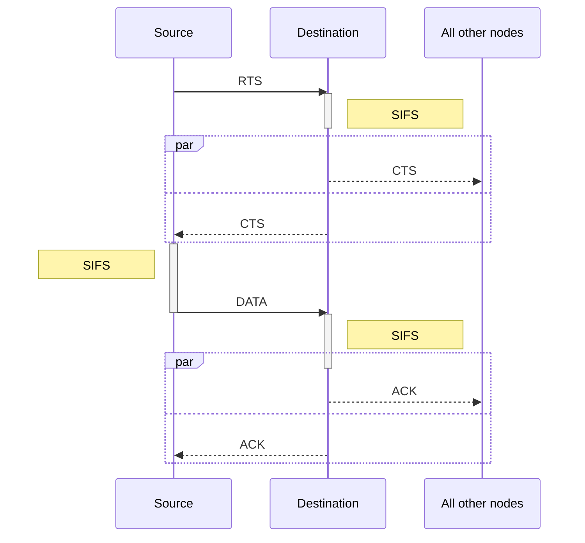

# Chapter7 Wireless and Mobile Networks

## 7-1 Introduction

## 7-2 Wireless links characteristics

important difference from wired link

+ decreased signal strength
+ interference from other sources: standardized wireless network frequencies (e.g., 2.4GHz) shared by other devices (e.g., phone)
+ multipath propagation: radio signal reflects off objects ground, arriving ad destination at slightly different rimes

### SNR v.s. BER tradeoffs

SNR: signal-to-noise ratio (越大表示雜訊越少)

BER: bit error rate

Dynamic selection of the physical-layer modulation technique can be used to adapt the modulation technique to cannel conditions.

當 SNR 較大時，切換到速度比較快的通道

### Hidden terminal Problem

+ A, B hear each

+ B, C hear each

+ **A, C can not hear each other** means A,C unaware of their interference at B

### CDMA (code division multiple access)

因為天線很難像 Ethernet 做全雙工所以不是 CSMA/CD (carrier sense multiple access/ collision detection) 而且還有 hidden terminal 的問題

802.11 只能做到 CA (collision avoidance)

## 7-3 IEEE 802.11

802.11b: 2.4GHz - 2.485CHz spectrum divided into 11 channels at different frequencies

+ AP admin chooses frequency for AP
+ interference possible: channel can be same as that chosen by neighboring AP

**802.11 passive/active scanning**

passive scanning: (一般常用)

1. beacon frames sent from APs
2. association request frame sent: Host to selected AP
3. association response frame sent from selected AP to Host

active scanning: (小氣的同學)

1. probe request frame broadcast from Host
2. probe response frames sent from APs
3. association request frame sent: Host to selected AP
4. association response frame sent from selected AP to Host

### The 802.11 MAC protocol

## 7-4 Cellular Internet access

## 7-5 Principles: addressing and routing to mobile users

What is mobility?

> + no mobility: mobile wireless user, using same access point
> 
> + low mobility: mobile user, connecting/disconnecting from network using DHCP.
> 
> + high mobility: mobile user, passing through multiple access point while maintaining ongoing connections (like cellphone)

### Approaches

1. let routing handle it. **too complex**

2. let end-system handle it.
   
   1. indirect routing
   
   2. direct routing

### Registration

> visited user 向 visited network 註冊
> 
> 

### Indirect routing

// TODO

### Direct routing

// TODO

## 7-6 Mobile IP

> RFC 3344
>
> Mobile IP has many features we've seen
>
> 1. home agents
>
> 2. foreign agents
>
> 3. foreign-agent registration
>
> 4. care-of-addresses
>
> 5. encapsulation
>
> Three components to standard
>
> 1. agent discovery
>
>    > Mobile IP defines the protocols used by a home or foreign agent to advertise its services to mobile nodes, and protocols for mobile nodes to solicit the services of a foreign or home agent.
>
> 2. registration with home agent
>
>    > Mobile IP defines the protocols used by the mobile node and/or foreign agent to register and deregister COAs with a mobile node's home agent
>
> 3. **indirect routing** of datagrams
>
>    > The standard also defines the manner in which datagrams are forwarded to mobile nodes by a home agent, including rules for forwarding datagrams, and several forms of encapsulation (RFC 2003, RFC 2004)

### 7-7 Handing mobility in cellular networks

Like mobile IP, **GSM adopts an indirect routing** approach, first routing the correspondent's call to the mobile user's home network and from there to the visited network. In GSM terminology, the mobile users' home network is referred to as the mobile user's **home public land mobile network** (home PLMN)

### 7-8 Mobility and higher-layer protocols
