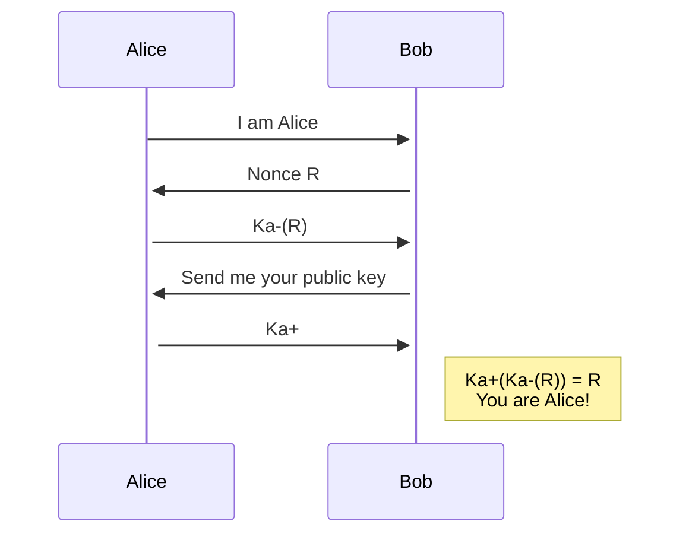
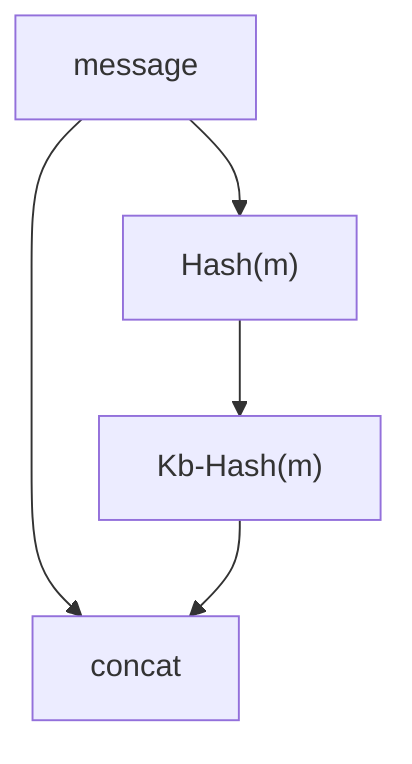
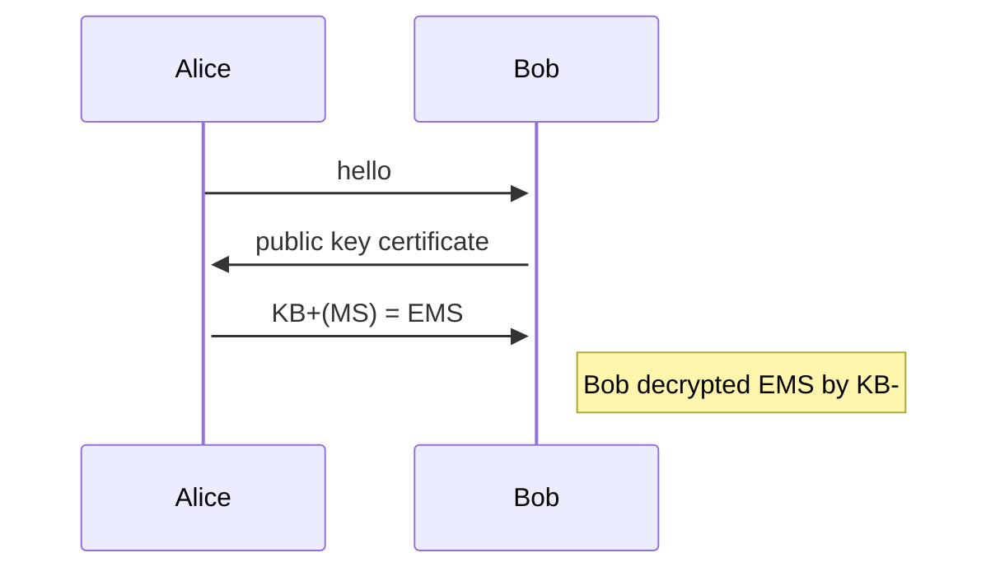

# Chapter8 Security

## 8-1 What is Network Security

1. confidentiality: 資料不可被第三方取得
2. authentication: 傳送雙方可互相識別身分
3. message integrity: 資料不可被中途竄改或可偵測是否遭竄改
4. access and availability: 服務必須對用戶來說是可使用的

## 8-2 Principles of Cryptography

## 8-3 Authentication, Message Integrity

### Authentication

Bob wants Alice to "prove" her identity to him

1. Alice says "I am Alice"
   
   > Trudy: I am Alice

2. Alice says "I am Alice" and add "IP address"
   
   > Trudy can create a packet "spoofing Alice's address"

3. Alice says "I am Alice" and sends her secret password to "prove" it
   
   > Trudy records Alice's packet and later plays it back to Bob
   > 
   > 重播攻擊

4. To prove Alice "live", Bob sends Alice **nonce**, R. Alice must return R, encrypted with shared secret key. Bob: because only Alice knowns key to encrypt nonce, it must be Alice.
   
   > But how to share symmetric key?

5. 
   

> Security hole
> Trudy in the middle: Trudy poses as Alice (to Bob) and as Bob (to Alice)

### Digital signatures

1. **Bob 給 Alice**

2. Bob 給 Alice 他的 public key
3. Alice 嘗試用 Bob 給的 public key 解開，如果加密文和平文相同，就代表他是 Bob，因為只有 Bob 知道怎麼加密

### Public-key certification

certification authority (CA): binds public key to particular entity, E.

E (person, router) registers its public key with CA.

+ E provides "poor of identity" to CA
+ CA creates certificate binding E to its public key.
+ certificate containing E's public key digitally signed by CA - CA says "this is E's" public key.

When Alice wants Bob's public key:

1. get Bob's certificate (Bob or elsewhere)
2. apply CA's public key to Bob's certificate, get Bob's public key

## 8-4 Securing E-mail

當 Alice 要寄信給 Bob 時

1. Alice 用一把對稱式金鑰 Ks 將訊息加密
2. Alice 用 Bob 的 public key Kb+ 將金鑰 Ks 加密

Bob 收訊時

1. Bob 用自己的 private key Kb- 解出金鑰 Ks 
2. 利用 Ks 將密文做解密

以上方法有個缺點，Trudy 可以偽裝成 Alice 送信給 Bob，所以 Bob 必需要能確定 Alice 就是 Alice

因此該方法只能實現機密性

當 Alice 要寄信給 Bob 時

1. 將訊息 hash 後用自己的 private key 做加密並與原本的訊息封裝再以對稱式金鑰 Ks 將訊息加密
2. Alice 用 Bob 的 public key Kb+ 將金鑰 Ks 加密

Bob 收訊時

1. Bob 用自己的 private key Kb- 解出金鑰 Ks 
2. 利用 Ks 將密文做解密，得到一組平文，和一個 hash 過並用 Alice 的 private key 加密過的平文；透過 Alice 的 public key 可以將此轉成 hash 後的平文，並將原本的平文 hash 後做比較，如果兩個相同，則代表沒有遭到竄改，並且因為可用 Alice 的 public key 解開被 Alice 的 private 加密後的密文，可以證明是 Alice 傳訊息的

以上方法可以實現機密性和可認證性和資料完整性

## 8-5 Securing TCP Connections: SSL

### A simple SSL

1. handshake: Alice and Bob use their certificates private keys to authenticate each other and exchange shared secret
2. key derivation: Alice and Bob use shared secret to derive set of keys
3. data transfer: data to be transferred is broken up into series of records
4. connection closure: special messages to securely close connection

> MS: master key, only be used for this SSL session
> 
> EMS: encrypted master key

MS, now shared by Bob and Alice, could be used as the symmetric session key for all subsequent encryption and data integrity checking. 

**key derivation**

Both Alice and Bob use the MS to generate four keys:

1. EB = session encryption key for data sent from Bob to Alice
2. MB = session MAC key for data sent from Bob to Alice
3. EA = session encryption key for data sent form Bob to Alice
4. MB = session MAC key for data sent from Bob to Alice

MAC: Message Authentication Code

**data record**

Break stream in series of record, and append MAC. 如果不切開而是整份資料最後附 MAC ，就得等最後的封包送達，因此 MAC 會分別放置於每個封包中

**sequence numbers**

Problem: Trudy can replay record or re-order records

Solution: put sequence number into MAC

Problem: Trudy can replay all records

Solution: use nonce

**control information**

Problem: Trudy can truncation attack, e.g.: forges TCP connection close segment.

Solution: record types, with one type for closure

### Real SSL

1. The client sends a list of cryptographic algorithms it supports, along with a client nonce.
2. From the list, the server chooses a symmetric algorithm (e.g., AES), a public key algorithm (e.g., FSA with a specific key length), and a MAC algorithm. It sends back to the client its choices, as well as a certificate and a server nonce.
3. The client verifies the certificate, extracts the server's public key, generates a Pre-Master Secret (PMS), encrypts the PMS, encrypts the PMS with the server's public key, and sends the encrypted PMS to the server.
4. Using the same key derivation function  (as specified by the SSL standard), the client and server independently compute the Master Secret (MS) from the PMS and nonces. The MS is then sliced up to generate the two encryption and CBC (such as 3DES or AES), then two Initialization Vector(IV) -- one for each side of the connection -- are also obtained from the MS. Henceforth, all messages sent between client and server are encrypted and authenticated (with the MAC).
5. The client sends a MAC of all the handshake messages.
6. The server sends a MAC of all the handshake messages.

### Connection closure

Trudy can get in the middle of an ongoing SSL session and end the session early with a TCP FIN.

The solution to this problem is to **indicate in the type field whether the record serves to terminate the SSL session**. Although the SSL type is sent in the clear, it is authenticated at the receiver using the record's MAC

By including such a field, if Alice were to receive a TCP FIN before receiving a closure SSL record, she would know that something funny was going on.

## 8-6 Network Layer Security: IPsec

IPsec datagrams are sent between pairs of network entities, such as between two hosts, between two routers, or between a host and router

SSL 是建立於 TCP 之上，而 IPsec 是建立於 IP 之上，主要有兩種協議

1. Authentication Header (AH) protocol: 缺乏機密性, 但有可驗證性和資料完整性
2. Encapsulation Security Protocol (ESP) (widely use than AH): 三者皆有

> Q: **An IPsec connection can use either AH or ESP protocol. Please list two different modes of a IPsec connection.**
> 
> A: AH: provides source authentication and data integrity, but not confidentiality. ESP: provides source authentication, data integrity, and confidentiality.

### Security associations (SAs)

Before sending data, SA established from sending to receiving entity. Ending, receiving entities **maintain state information about SA**. 

+ TCP endpoints also maintain state info
+ IP is connectionless; IPsec is connection-oriented!

> Q: **What is security association used in IPsec?**
> 
> A: Before sending data, a virtual connection is established from sending entity to receiving entity.

### Security Association Database (SAD)

+ endpoint holds SA state in security association database (SAD), where it can locate them during processing.

+ with n salespersons, 2+2n SAs in R1's SAD. Why? //TODO

+ when sending IPsec datagram, R1 access SAD to determine how to process datagram.

+ when IPsec datagram arrives to R2, R2 examines SP1 in IPsec datagram, indexes SAD with SPI, and processes datagram accordingly

### IKE: Internet key exchange. Key Management In IPsec

When a VPN has a small number of end points, the network administrator can manually enter the SA information into the SADs.

Large, geographically distributes deployments require an automated mechanism (自動化機制) for creating the SAs.

> Q: **What is the purpose of Internet key exchange?**
> 
> A: It is used to set up SA in the IPsec protocol suite.

## 8-7 Securing Wireless LANs

## 8-8 Operational Security: Firewalls and IDS
