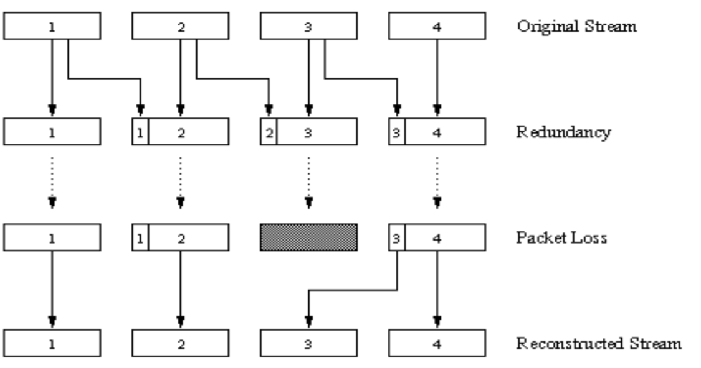
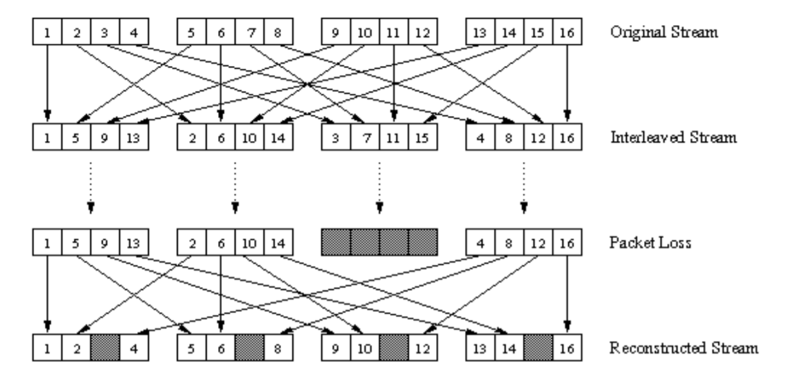
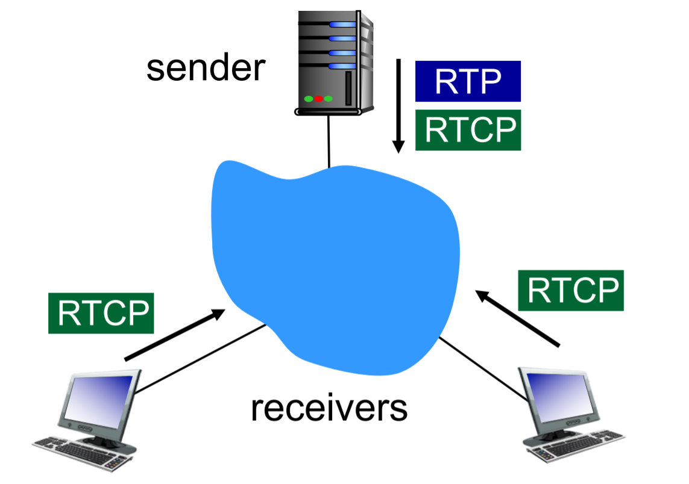
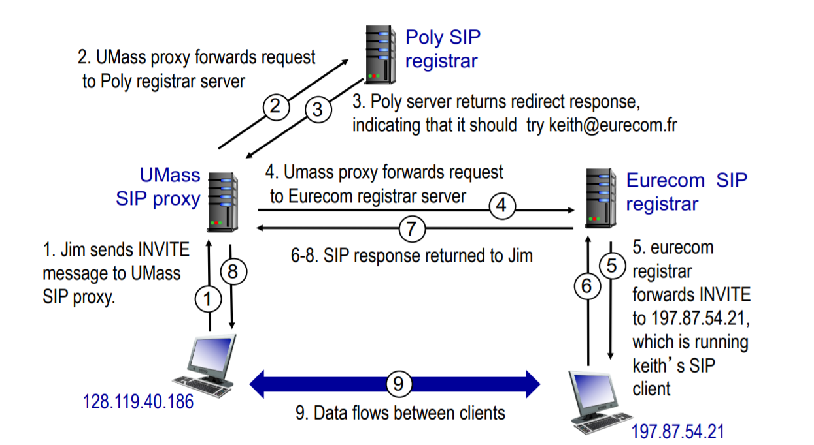
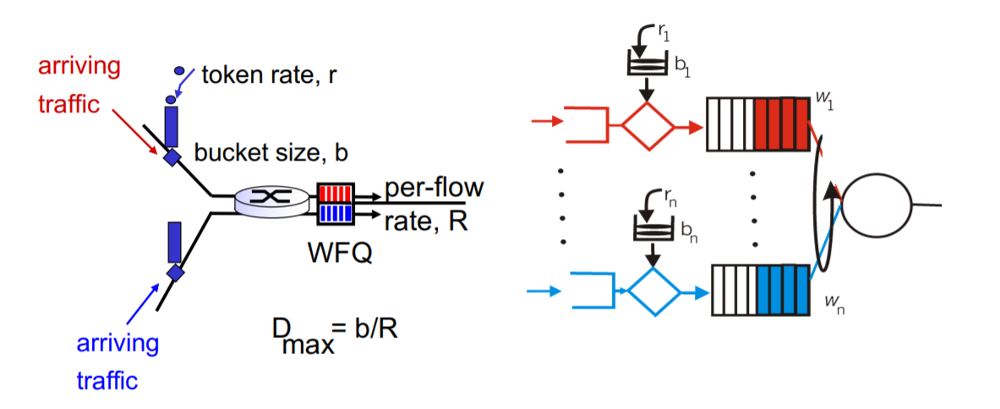

# Chapter 9

## 9-1 Multimedia networking: Outline

+ streaming, stored audio video
  + streaming: can begin playout before downloading entire file
  + stored (at server): can transmit faster than audio/video will be rendered
+ conversational voice/video over IP
  + interactive nature of human-to-human conversation limits delay tolerance
+ streaming live audio, video

## 9-2 Streaming stored video

continuous playout constraint: once client playout begins, playback must match original timing. But **network delays** are variable (**jitter**), so will need client-side buffer to match playout requirements

### UDP streaming

Although UDP streaming has been employed in many open-source systems and proprietary products, it suffers from three significant drawbacks.

1. unpredictable and varying amount of available bandwidth between server and client, constant-rate UDP streaming can fail to provide continuous playout.
2. UDP streaming is that it requires a media control server, to process client-to-server interactivity requests and to track client state.
3. Many firewalls are configured to block UDP traffic

### HTTP streaming

+ multimedia file retrieved via HTTP GET

+ send at maximum possible rate under TCP

+ fill rate fluctuated (波動的) due to TCP congestion control, retransmissions

+ larger playout delay: smooth TCP delivery rate

+ HTTP/TCP passes more easily through firewalls

## 9-3 Voice-Over-IP (VoIP)

VoIP end-end-delay requirement: needed to maintain "conversational" aspect

+ network loss: IP datagram lost due to network congestion (router buffer overflow)

+ delay loss: IP datagram arrives too late for playout at receiver

+ loss tolerance: depending on voice encoding, loss concealment, packet loss rates between 1% and 10% can be tolerated

**talkspurt**: VoIP 封包只有在用戶有通話時才會傳送資料，不講話他就不傳免的浪費流量

### Adaptive playout delay

goal: low playout delay, low late loss rate

approach: adaptive playout delay adjustment

+ estimate network delay, adjust playout delay at beginning of each talk spurt
+ silent periods compressed and elongated
+ chunks still played out every 20 ms during talk spurt

### Recovery from packet loss(1)

Use FEC (Forward Error Correction)

simple FEC

+ for every group of *n* chunks, create redundant chunk by XOR *n* original chunks
+ send *n+1* chunks, increasing bandwidth by factor 1/n.
+ can reconstruct original n chunks if at most one lost chunk from n+1 chunks, with playout delay

### Recovery from packet loss(2)

**piggyback lower quality stream**: 把第一個封包的資料有損壓縮放入第二個封包 (send lower resolution audio stream as redundant information)

### Recovery from packet loss(3)

interleaving

## 9-4 protocols for real-time conversational applications: RTP, SIP

### Real-Time Protocol (RTP)

RFC 3550

+ RTP packet provides
  
  + payload type identification
  
  + packet sequence numbering
  
  + time stamping

+ **RTP runs in end systems (between layer4 and layer5)**

+ RTP packets encapsulated in UDP segments

+ interoperability: if two VoIP apps run RTP, they may be able to work together

+ RTP runs on top of UDP 

+ RTP libraries provide transport-layer interface that extends UDP:
  
  + port numbers, IP address
  
  + payload type identification
  
  + packet sequence numbering 
  
  + time stamping

+ QoS
  
  > **RTP does NOT provide** any mechanism to ensure timely data delivery or other **QoS guarantees**
  > 
  > RTP encapsulation only seen at end systems (not by intermediate routers)
  > 
  > Routers provide best-effort service(盡力而為), making no special effort to ensure that RTP packets arrive at destination in timely matter

+ RTP header
  
  + **timestamp** field (32bits): sampling instant of first byte in this RTP data packet
    
    + for audio 
  
  + **SSRC** field (32 bits): identifies source of RTP stream. Each stream in RTP session has distinct SSRC
  
  + **payload type** (7 bits): indicates type of encoding currently being used.
  
  + **sequence** # (16 bits): increment by one for each RTP packet sent (detect packet loss, restore packet sequence)

### Real-Time Control Protocol (RTCP)

+ works in conjunction RTP
+ each participant in RTP session periodically sends RTCP control packets to all other participants
+ each RTCP packet contains sender and/or receiver reports

#### Multiple multicast senders

RTP, RTCP packets distinguished from each other via distinct port numbers

To limit traffic, each participant reduces RTCP traffic as number of conference participants increases

#### RTCP packet types:

1. receiver report packets

2. sender report packets

3. source description

#### Stream synchronization

> **RTCP can synchronize different media streams within a RTP session**
> 
> Timestamps in RTP packets tied to the video, audio sampling clocks. Not tied to wall-clock time (系統時間)
> 
> each RTCP **sender-report packet** contains
> 
> 1. timestamp of RTP packet
> 2. wall-clock time for when packet was created
> 
> receivers uses association to synchronize playout of audio, video

#### Bandwidth scaling

RTCP attempts to limit its traffic to 5% of session bandwidth

> For example: 
> 
> one sender sending video 2 Mbps. RTCP attempts limit RTCP traffic to 100Kbps ($2000\times 5\%=100$)
> 
> RTCP give 75% to receivers; remaining 25 to sender

### Session Initiation Protocol (SIP)

> SIP in go: https://godoc.org/github.com/jaroszan/sip
> 
> 主要在管理連線的部分，封包內採用類似 HTTP 的格式，只管連線，詳細的實作不做定義
> 
> caller (打電話者) callee (接電話者)

**SIP provides mechanisms for establishing calls between a caller and a callee over an IP network**. It allows the caller to notify the callee that it wants to start a call. It allows the participants to agree on media encodings. It also allows participants to end calls.

SIP provides mechanisms for call setup

1. For caller to let callee know she wants to establish a call. So caller, callee can agree on media type, encoding

2. To end call

3. Determine current IP address of callee
   Maps mnemonic identifier to current IP address

4. Call management
   
   1. add new media during call
   2. change encoding during call
   3. invite others
   4. transfer, hold calls

#### SIP proxy

another function of SIP server: proxy

Alice sends invite message to her proxy server

+ contains address sip: bob@domain.com
+ proxy responsible for routing SIP messages to callee, possibly through multiple proxies

Bob sends response back through same set of SIP proxies

proxy returns Bob's SIP response message to Alice

SIP proxy analogous to local DNS server plus TCP setup

## 9-5 Network support for multimedia

three broad approaches towards providing network-level support for multimedia applications

1. Making the best of best-effort service:
   
   > When demand increases are forecasted, the ISPs deploy additional bandwidth

2. Differentiated service
   
   > In early days. ToS (Type-of-Service)
   > 
   > With differentiated service, one type of traffic might be given strict priority over another class of traffic when both types of traffic are queued at a router.

3. Per-connection Quality-of-Service (QoS) Guarantees.
   
   > With per-connection QoS guarantees, each instance of an application explicitly reserves end-to-end bandwidth and thus has a guaranteed end-to-end performance

### Dimensioning Best-Effort Networks

1. Bandwidth provisioning: How much capacity to provide at network links in a given topology to achieve a given level of performance.
2. Network dimensioning: How to design a network topology to achieve a given level of end-to-end performance

#### Scenario: mixed HTTP and VoIP

HTTP bursts can congest router, cause radio loss

> packet marking needed for router to distinguish between different classes; and new router policy to treat packets accordingly (router 會給 VoIP 封包一定的頻寬)

### Providing Multiple Classes of Service

**Policing**

1. **marking, policing at network edge**

2. provide protection (**traffic isolation**) for one class from others 
   
   > What if applications misbehave (VoIP sends higher than declared rate) ? 
   > force source adherence(遵守) to bandwidth allocations. 

3. while providing isolation among classes or flows, it is desirable to use resources (i.e., link bandwidth and buffers) as efficiently as possible
   
   > Because allocating fixed bandwidth to flow is inefficient use of bandwidth if flows doesn't use its allocation

4. call admission: flow declares its need, network may block call (e.g., busy signal) if it cannot meet needs

**The Leaky Bucket**

We can identify three important policing criteria, each differing from the other according to the time scale over which the packet flow is policed

1. Average rate. The network may wish to limit the long-term average rate
2. Peak rate.  A peak-rate constraint limits the maximum number of packets that can be sent over a shorter period of time.
3. Max burst size. The network may also wish to limit the maximum number of packets that can be sent into the network over an extremely short interval of time.

The leaky bucket mechanism is an abstraction that can be used to characterize these policing limits.

> Before a packet is transmitted into the network, it must first remove a token from the token bucket. If the token bucket is empty, the packet must wait for a token. 

1. average rate: r packets/s
2. peak rate: rt + b packets/s
3. Max burst size: b packets.

token bucket, WFQ combine to provide guaranteed upper bound on delay, i.e., QoS guarantee!

### Differentiated services

> simple functions in network core, relatively complex functions at edge routers

#### Edge router

1. **Per-flow** traffic management

2. Edge router marks packets as in-profile and out-of-profile
   
   > + Packet is marked in the Type of Service (TOS) in IPv4, and Traffic Class in IPv6
   > 
   > + 6 bits used for Differentiated Service Code Point (DSCP)
   >   
   >   + determine PHB that the packet will receive
   >   + 2 bits currently unused

#### Core router

1. **Per-class** traffic management
2. Buffering and scheduling based on marking at edge
3. preference given to in-profile packets over out-of-profile packets

#### Forwarding per-hop behavior (PHB)

PHB result in a different observable (measurable) forwarding performance behavior

PHB does not specify what mechanisms to use to ensure required PHB performance behavior

Example:

> + class A gets x% of outgoing link bandwidth over time intervals of a specified length
> + class A packets leave first before packets from class B

**PHBs proposed:**

+ **expedited forwarding**: packet departure rate of a class equals or exceeds specified rate
  + logical link with a minimum guaranteed rate
+ **assured forwarding**: 4 classes of traffic
  + each guaranteed minimum amount of bandwidth
  + each with three drop preference partitions

#### Per-connection QoS guarantees

1. resource reservation.
   
   > The only way to guarantee that a call will have the resources needed to meet its desired QoS is to explicitly allocate those resources to the call

2. Call admission
   
   > If resources are to be reserved, then the network must have a mechanism for calls to request and reserve resources.

3. Call setup signaling
   
   > The call admission process described above requires that **a call be able to reserve sufficient resources at each and every network router** on its source-do-destination path to ensure that its end-to-end QoS requirement is met.