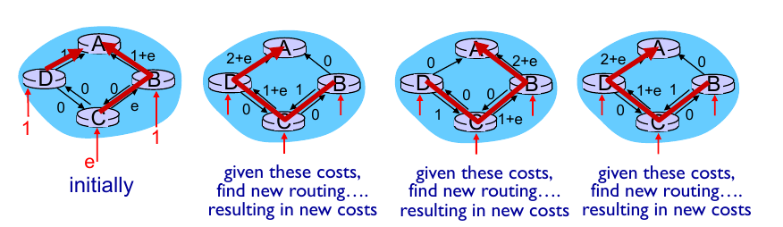
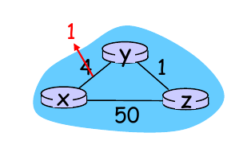
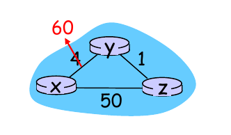
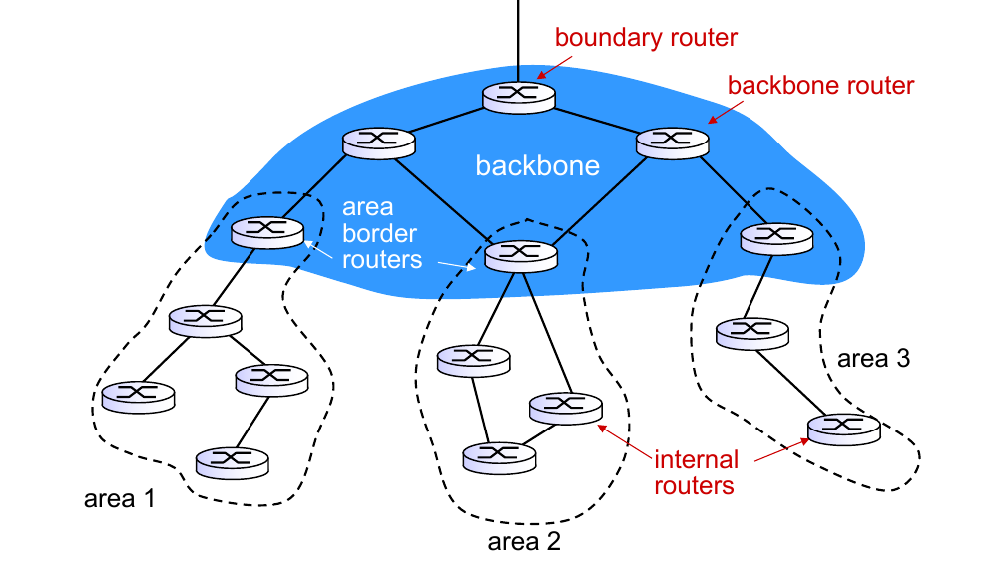
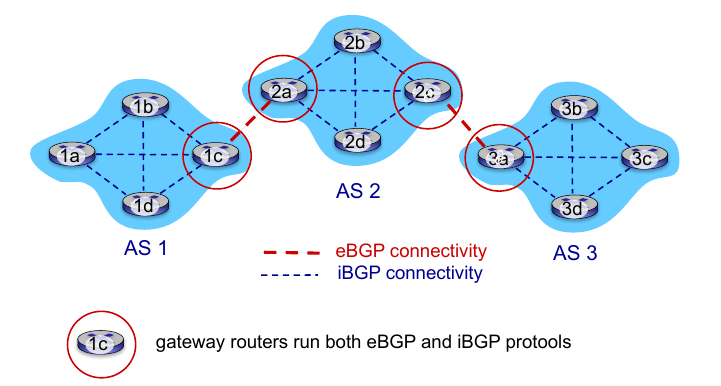

# Chapter5 Network Layer: The Control Plane

## 5-1 Introduction

**Recall: 2 network-layer functions:**

1. **forwarding**: move packets from router's input to appropriate router output. **(data plane)**

2. **routing**: determine route taken by packets from source to destination. **(control plane)**

**2 approaches to structuring network control plane.**

1. per-router control (traditional)

2. logically centralized control (software defined networking)

### Per-router control plane

Individual routing algorithm components in each and every router interact with each other in control plane to compute forwarding tables.

### Logically centralized control plane

A distinct (typically remote) controller interacts with local control agents (CAs) in routers to compute forwarding tables.

## 5-2 Routing Algorithms

**Goal:** determine "good" paths (equivalently, routes), from sending hosts to receiving host, through network of routers.

### Routing algorithm classification

#### Global or Decentralized?

##### Global:

> all routers have complete topology, link cost info
> 
> **link state** algorithms (**LS**)

##### Decentralized:

> routers knows physically-connected neighbors, link costs to neighbors.
> 
> iterative process of computation, exchange of info with neighbors.
> 
> **distance vector** algorithms (**DV**)

#### Static or dynamic?

##### Static:

> routes change slowly over time

##### Dynamic: (LS, DV)

> routes change more quickly
> 
> + periodic update
> 
> + in response to (對...的反應) link cost changes 

### A link-state routing algorithm

#### Dijkstra's algorithm

+ net topology, link costs known to all nodes
  
  + accomplished via "link state broadcast"
  
  + all nodes have same info

+ computes least cost paths from one node to all other nodes

+ iterative: after k iterations, know least cost path to k destinations

##### Algorithm complexity:

> n nodes
> 
> each iteration: need to check all nodes, w, not in N
> 
> n(n+1)/2 comparisons: O(N2)
> 
> more efficient implementation possible: O(nlogn)

##### Oscillations possible:

> **說明**
> 
> 一開始時，D 到 A 為 1, B 到 A 也為 1, 因此 C 到 A 隨便走一條，比如經過 B 好了，變成 C -> B -> A。再下一個 run 開始前 B 會通知大家他到 A 很滿(1+e)，所以大家往另一個方向送(圖2)，但是這又導致 D 到 A 很滿，所以 D 又通知大家往別的方向(圖3)，依此類推，不斷振盪

### Distance vector algorithm

#### Bellman-Ford

*FROM x TO y:*

$$
d_x(y) = min\{c(x,v)+d_v(y)\}
$$

> $c(x,v)$: cost to neighbors $v$
> 
> $d_v(y)$: cost from neighbor $v$ to destination $y$, estimate of least cost form $v$ to $y$.
> 
> node x:
> 
> + knows cost to each neighbor v: $c(x,v)$
> 
> + maintains its neighbors' distance vectors. For each neighbor v,x maintains
> 
> + $D_v = [D_v(y): y\in N]$

*idea*

> from time-to-time, each node sends its own distance vector estimate to neighbors
> 
> when x receives new DV estimate from neighbor, it updates its own DV using B-F equation.

#### Link cost changes

*link cost changes 1 (good news):*

> 
> 
> + node detects local link cost change
> 
> + updates routing info, recalculates distance vector
> 
> + if DV changes, notify neighbors
> 1. y detects link-cost change, updates its DV, informs its neighbors.
> 
> 2. z receives update from y, updates its table, computes new least cost to x, send its neighbors its DV.
> 
> 3. y receives z's update, updates it distance table. y's least costs do not change, so y does not send a message to z.

*link cost changes 2: (bad news)*

> 
> 
> + node detects local link cost change.
> 
> + bad news travels slow - **"count to infinity"** problem!
> 
> + 44 iterations before algorithm stabilizes.

**SOLUTION: POISON REVERSE:**

> + if **z** routes through **y** to get to **x**: **z** tells **y** its distance to **x** is infinite (so **y** won't route to **x** via **z**). **z** will continue telling this little white lie to **y** as long as it routes to **x** via **y**. Since **y** believes that **z** has no path to **x**, **y** will never attempt to route to **x** via **z**, as long as **z** continues to route to **x** via **y**.
> 1. 在情況改變前 $D_z(x)$ = 5 而情況改變後，$D_z(x)$ 沒有即時反應，所以 **y** 在送封包時會往 **z** 送，而 **z** 會再往 **y** 回送
> 
> 2. 因為 **y** 誤判所以 **y** 以為送到 **x** 是 6 (y->1->z->錯的 5->x)
> 
> 3. 重複幾次後 **y** 到 **x** 的距離會變 7, 8, 9, ... 直到超過 60
> 
> > Does poisoned reverse solve the general **count-to-infinity** problem?
> > 
> > It does NOT. You should convince yourself that loops involving three or more nodes (rather than simply two immediately neighboring nodes) will not be detected by the poisoned reverse technique.

**Good news travels fast; But Bad news travels slow**

> 如果有一條 link 變快了，那麼整體路徑可以很快反應。但如果有一條 link 變慢了，整體路徑無法迅速反應。

#### Comparison of LS and DV algorithms

+ message complexity: 
  
  > **LS**: With **n** nodes **E** links, O(nE) msgs sent
  > 
  > **DV**: Exchange between neighbors only.

+ <mark>speed of convergence:</mark>
  
  > **LS**: O(n2) algorithm requires O(nE) messages. **May have oscillations**
  > 
  > **DV**: Convergence time varies. (收斂的時間不同) May be **routing loops**, **count-to-infinity problem**

+ robustness:
  
  > **LS**: Node can advertise(發佈) <mark>incorrect link cost</mark>. Each node computes only its own table.
  > 
  > **DV**: DV node can advertise(發佈) <mark>incorrect path cost</mark>. Each node's table used by others. Error propagate thru network(錯誤在網路中傳播)

|      | Message complexity                                    | Convergence                                         | Robustness                                       |
| ---- | ----------------------------------------------------- | --------------------------------------------------- | ------------------------------------------------ |
| DV   | Exchange between neighbors only.                      | 收斂的時間不同(count-to-infinity problem)           | advertise(發佈) <mark>incorrect link cost</mark> |
| LS   | With **n** nodes **E** links, **O(nE)** messages sent | O(n2) algorithm requires O(nE) messages. | advertise(發佈) <mark>incorrect path cost</mark> |

+ 整理：

> **LS**
>
> + 使用Link-State路由演算法的路由器都會持有一份完整的網路拓樸資訊，當然包含這些網路之間是如何連接等種種資料。另外，LSA的觸發是當網路變化時就會馬上送出，所以網路資料「收斂」速度比較快。
>
> + 因為Link-State路由演算法是使用Dijkstra的最短路徑演算法來計算網路中的最短路徑，而這種演算法需要大量的CPU運算時間，所以如果網路架構很大或是擁有很複雜的網路架構時，Link-State路由演算法就會占用許多CPU運算。此外，如果網路中常常發生設備不穩定或是網路連線不穩定的情況，就會造成Dijkstra演算法計算頻率升高，如此一來，也會讓CPU使用率飆高。
>
> **DV**
>
> + TODO
> + **Good news travels fast; But Bad news travels slow**

---

### Making routing scalable

our routing study thus far - idealized

1. all routers identical

2. network flat

... not true in practice

**scale:**

+ can't store all destinations routing tables!

+ routing table exchange would swamp(使陷入困境) links!

**administrative autonomy**: (自治)

+ internet = network of network

+ each network admin may want to control routing in its own network

---

> 有些路由協定是運作在同一個自治系統中，而某些路由協定則運作在不同的自治系統之間。若以運作於自治系統的內部與外部來區分路由協定，則可以分成內部路由協定（Interior Gateway Protocol）與外部路由協定（Exterior Gateway Protocol）。<mark>內部路由協定簡稱為IGP，外部路由協定則簡稱為EGP</mark>。
> 
> 剛剛介紹的 LS 和 DV 都是內部路由協定

forwarding table configured by both intra-AS and inter-AS

## 5-3 Intra-AS routing in the Internet: OSPF

AS: Autonomous system (自治系統)

> <mark>基於IP協定的路由協定，運作於自治系統內部，採用 Dijkstra 來計算最短路徑樹</mark>
> 
> <mark>OSPF協定不使用TCP或者UDP協定而是直接承載在IP協定之上，IP協定號為89</mark>

### Intra-AS Routing

+ also known as **interior gateway protocols (IGP)**

+ most common intra-AS routing protocols
  
  + RIP: Routing information Protocol
  
  + **OSPF: Open Shortest Path First**
  
  + IGRP: Interior Gateway Routing Protocol

#### OSPF (Open shortest Path First) / LS & Dijkstra

+ Open: publicly available

+ uses link-state algorithm (dijkstra, 每個 router 都有整個 intra-AS 的拓樸)

+ router floods OSPF link-state advertisements to all others routers in entire AS

+ IS-IS routing protocol: nearly identical (幾乎相同) to OSPF

> Advanced features:
> 
> + **security** all OSPF messages **authenticated** (to prevent malicious intrusion).
> 
> + **multiple same-cost paths allowed** (only one path in RIP)
> 
> + integrated **uni- and multi-cast support**
>   
>   + Multi-cast OSPF (MOSPF) uses same topology data bases as OSPF
> 
> + **hierarchical** OSPF in large domains.

#### Hierarchical OSPF

一個 hierarchical 的 AS ↓

+ two-level hierarchy: local area, backbone(骨幹).
  
  + link-state advertisements only in area
  
  + each nodes has detailed area topology; only know direction (shortest path) to nets in other areas.

+ **area border routers**: "summarize" distances to nets in own area, advertise to other Area Border routers.

+ **backbone routers**: run OSPF routing limited to backbone.

+ **boundary routers**: connects to other AS'es

## 5-4 Routing across Multiple AS: BGP (TCP :179)

> **BGP (Border Gateway Protocol)** 使用 TCP 實作
> 
> BGP的鄰居關係（或稱通信對端/對等實體，peer）是通過人工組態實現的，對等實體之間通過TCP埠179建立對談交換資料。BGP路由器會周期地傳送19位元組的保持存活（keep-alive）訊息來維護連接（預設周期為60秒）。在各種路由協定中，只有 BGP 使用 TCP 作為傳輸層協定。

BGP provides each AS a means to:

+ Obtain prefix reachability information from neighboring ASs. In particular BGP allows subnet to advertise its existence to rest of internet: "I am here"
+ determine "good" routes to other networks based on reachability information and <u>policy</u>

**eBGP**: (對外) obtain subnet reachability information form neighbors ASes. (對外)

**iBGP**: (對內) propagate reachability information to all AS-internal routers. (對內)

### BGP basics

+ BGP session: two BGP routers ("peers") exchange BGP messages over semi-permanent TCP connection (port 179).
  
  > advertising paths to different destination network prefixes (BGP is a "path vector" protocol) 

### Path attributes and BGP routes

+ advertised prefix includes BGP attributes
  
  prefix + attributes = route

+ two important attributes
  
  1. **AS-PATH**: list of ASes through which prefix advertisement has passed
  
  2. **NEXT-HOP**: indicates specific internal-AS router to next-hop AS

### Hot potato routing

> choose local gateway that has least intra-domain cost (Don't worry about inter-domain cost)

### BGP messages

BGP message exchanged between peers over TCP connection

+ OPEN: opens TCP connection to remote BGP peer and authenticates sending BGP peer
+ UPDATE: advertises new path (or withdraws old)
+ KEEPALIVE: keeps connection alive in absence of UPDATES; also ACKs OPEN request
+ NOTIFACATION: reports errors in previous message; also used close connection

### BGP route-selection algorithm

route may learn about more than one route to destination AS, selects route based on:

1. local preference value attribute: **policy decision**

2. **shortest AS-PATH** (DV algorithm for path determination rather than the number of router hops)

3. **closet NEXT-HOP** router: hot potato routing

4. additional criteria

### Why different Intra-, Inter-AS routing?

**1. policy**

+ inter-AS: (需考慮) admin wants control over how its traffic routed, who routes through its net.

+ intra-AS: (不用考慮，反正都是自己人) single admin, so no policy decisions needed

**2. scale**

+ hierarchical routing saves table size, reduced update traffic

**3. performance**

+ intra-AS: can focus on performance
+ inter-AS: policy may dominate over performance
